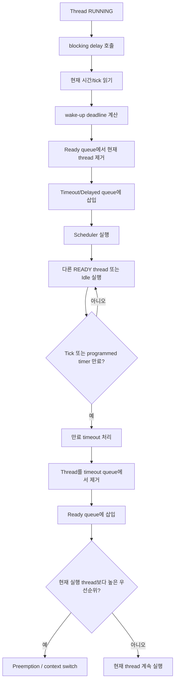
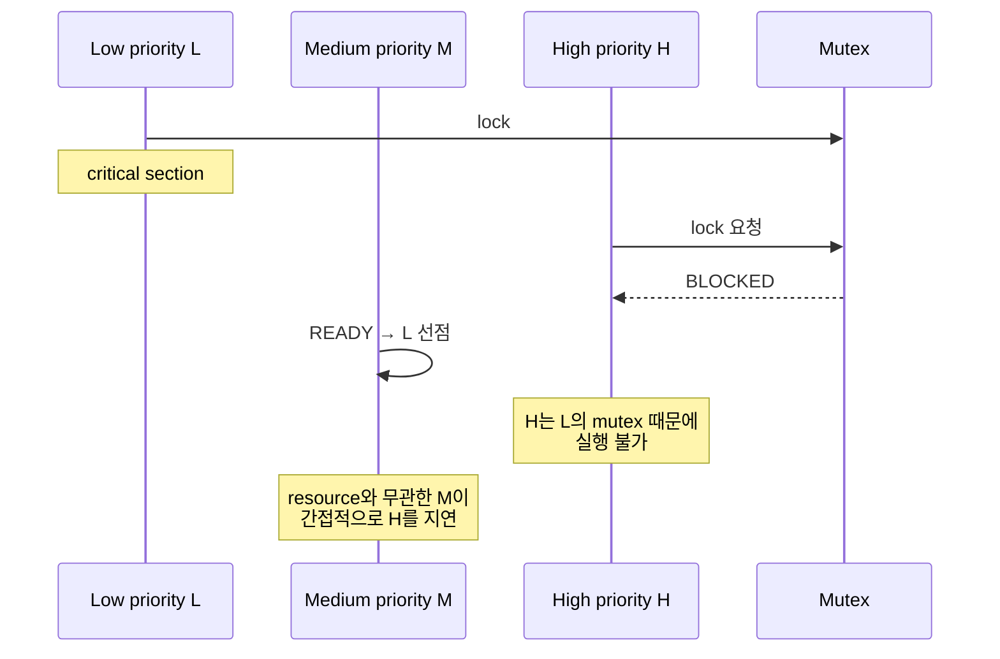
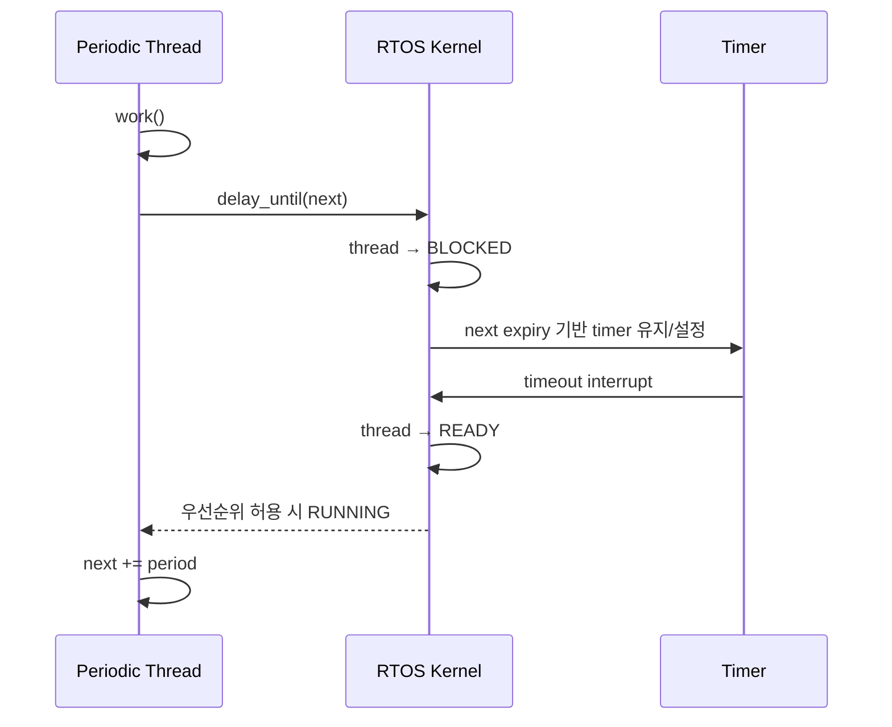
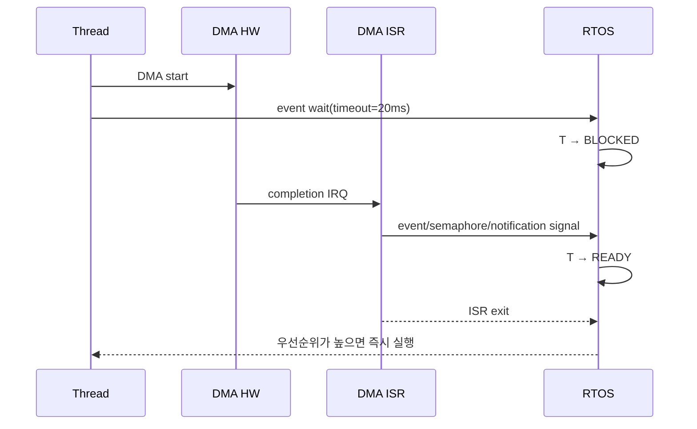
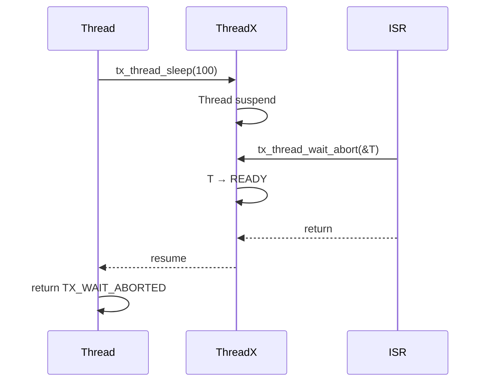
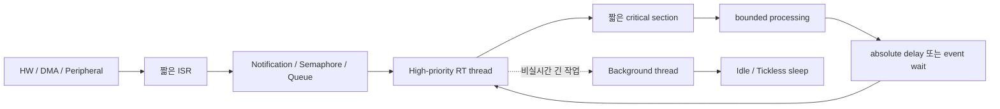

# RTOS의 블로킹 지연, 스레드 블로킹, `OS_delay()` 계열 API와 ISR 상호작용 분석 보고서

## 핵심 결론

### Executive summary

본 보고서는 **버전 미지정** 조건을 적용해 2026년 8월 19일 기준 최신 안정 릴리스인 **FreeRTOS Kernel V11.3.0**, **Zephyr v4.4.2**, **Eclipse ThreadX v6.5.1.202602a**를 기준으로 분석한다. FreeRTOS V11.3.0은 2026년 3월 30일, Zephyr v4.4.2는 2026년 8월 7일, ThreadX v6.5.1.202602a는 2026년 6월 8일 공개된 최신 안정 릴리스다. ThreadX API 상세 문서는 6.5.1 계열 문서를 사용했으며, 202602a는 Cortex-M3/M4/M7 빌드 회귀를 수정한 hotfix이므로 본 주제의 sleep API 시맨틱에는 별도 변경이 명시되어 있지 않다. citeturn18view0turn21view0turn21view1

가장 중요한 결론은 다음과 같다.

**확인된 사실:** RTOS의 blocking delay는 일반적으로 CPU를 일정 시간 “멈추는” 기능이 아니다. 호출한 스레드를 `READY/RUNNING` 집합에서 제거하고, 만료 시간 정보를 timeout/delayed queue에 넣은 뒤 다른 runnable thread를 실행한다. 시간이 만료되면 해당 스레드를 다시 `READY`로 만들며, **실제 실행 재개 시각은 우선순위와 ISR·다른 runnable thread의 간섭에 의해 만료 시각보다 늦어질 수 있다.** CMSIS-RTOS2의 `osDelay()`도 thread를 BLOCKED 상태로 만들고 즉시 context switch하며, 지정 tick 후 READY로 되돌린다고 명시한다. citeturn14search0turn14search10

**확인된 사실:** 따라서 “blocking delay”와 “busy wait”는 근본적으로 다르다. `vTaskDelay()`, `k_sleep()`, `tx_thread_sleep()`은 CPU를 양보하는 blocking primitive인 반면, 예를 들어 Zephyr `k_busy_wait()`은 CPU를 relinquish하지 않는다. 아주 짧은 hardware-settling delay에는 busy wait가 합리적일 수 있지만, millisecond 단위 이상의 일반적인 기다림을 busy wait로 구현하면 낮은 우선순위 스레드와 idle/저전력 진입 기회를 불필요하게 제거한다. citeturn16search0turn15search0

**확인된 사실:** `OS_delay()`라는 이름 자체는 FreeRTOS, Zephyr, ThreadX가 공유하는 표준 API가 아니다. 본 보고서에서는 이를 **“현재 스레드를 일정 시간 blocked 상태로 만드는 일반적인 RTOS delay primitive”**라는 추상 명칭으로 사용한다. 표준화된 유사 이름은 CMSIS-RTOS2의 `osDelay()`/`osDelayUntil()`이고, FreeRTOS는 `vTaskDelay()`/`xTaskDelayUntil()`, Zephyr는 `k_sleep()`, ThreadX는 `tx_thread_sleep()`을 사용한다. citeturn14search3turn18view1turn15search0turn22view0

**확인된 사실:** 이러한 blocking-delay API는 **ISR에서 호출해서는 안 된다.** CMSIS `osDelay()`는 ISR에서 `osErrorISR`; ThreadX `tx_thread_sleep()`은 Threads only이며 비-thread caller에는 `TX_CALLER_ERROR`; FreeRTOS는 ISR에서 `...FromISR()` 계열 API를 사용해야 하고 `vTaskDelay()`에는 ISR용 버전이 없다. Zephyr도 `k_can_yield()`가 ISR처럼 blocking/yield가 불가능한 context를 식별하도록 제공한다. citeturn14search0turn22view0turn17search15turn15search0

**설계 판단:** ISR에서 “10 ms 기다렸다가 다음 단계 수행” 같은 코드는 RTOS delay를 호출하는 방식이 아니라, **ISR → event/semaphore/notification → thread → 필요 시 blocking delay** 또는 **hardware/software timer → thread wakeup** 구조로 바꾸는 것이 정석이다. ISR이 기다리면 그 인터럽트 레벨 이하의 시스템 진행을 방해하고, blocking API는 “현재 thread”와 scheduler context를 전제로 하므로 의미 자체가 성립하지 않는다. FreeRTOS는 ISR-safe API로 높은 우선순위 task를 깨우고 ISR exit에서 context switch하도록 지원하며, Zephyr도 ISR에서 깨운 thread에 대한 scheduling을 ISR exit 시 처리할 수 있다. citeturn19view2turn16search0

**확인된 사실:** delay의 시간 자료구조는 RTOS마다 크게 다르다. FreeRTOS V11.3.0은 wake time 순으로 정렬된 delayed list와 overflow delayed list를 사용하고, 정렬 삽입은 리스트 순회 때문에 최악 `O(N)`이다. Zephyr는 기본 delta-ordered doubly-linked timeout list가 `O(N)` 삽입이며, 선택적으로 min-heap `O(log N)`, timer wheel 또는 bucket 기반 near-timeout `O(1)` backend를 사용할 수 있다. ThreadX는 timer-entry ring/list 구조를 사용하며 low-power/tickless 코드에서 timer entries를 순회하고 wrap하는 구조가 확인된다. citeturn19view0turn19view1turn15search1turn21view5

**설계 판단:** `delay()` 자체보다 더 위험한 것은 **mutex를 잡은 상태에서 delay/blocking I/O를 수행하는 것**이다. 이 패턴은 resource ownership 시간을 의도적으로 늘려 높은 우선순위 thread의 blocking bound를 증가시키고 priority inversion을 악화한다. Sha·Rajkumar·Lehoczky의 고전적 연구는 일반 semaphore 등으로 공유 자원을 다룰 때 uncontrolled priority inversion이 발생할 수 있으며 priority-inheritance/priority-ceiling protocol로 blocking을 제한할 수 있음을 보였다. citeturn20search0turn20search4

보고서에서 사용하는 증거 표시는 다음과 같다.

| 표시 | 의미 |
|---|---|
| **확인된 사실** | 공식 문서·소스 또는 원논문에서 직접 확인 가능 |
| **설계 추론** | 확인된 구현을 근거로 도출한 engineering conclusion |
| **불확실/구현 의존** | CPU port, compiler, SMP/FPU/MPU, 설정 등에 따라 달라 일률적 수치화 불가 |

하드웨어 타이머 **데이터시트는 특정 MCU/SoC가 지정되지 않았으므로 인용하지 않았다.** SysTick, CLINT, GPT, RTC 등의 실제 interrupt latency와 timer-programming cost는 target별 데이터시트와 RTOS port를 별도로 WCET 분석해야 한다.

## 상세 분석

### Blocking delay의 정확한 의미

전형적인 blocking delay를 수식으로 표현하면 호출 순간을 \(t_0\), 요청 지연을 \(D\), timeout 만료를 \(t_w\)라 할 때 대략 다음 상태 천이를 거친다.

\[
RUNNING
\rightarrow BLOCKED(timeout=t_w)
\rightarrow READY
\rightarrow RUNNING
\]

여기서 가장 중요한 점은

\[
t_{\text{run again}} \ge t_w
\]

라는 것이다.

**확인된 사실:** timer 만료가 보장하는 것은 보통 “그 thread가 다시 **실행 가능(READY)** 하게 되는 시점”이지 “그 CPU에서 정확히 실행되는 시점”이 아니다. CMSIS-RTOS2 역시 delay가 만료되면 thread를 READY로 만들고, 그때 가장 높은 READY 우선순위인 경우에야 즉시 schedule된다고 정의한다. citeturn14search0turn14search10

즉 다음 코드는:

```c
do_something();
OS_delay(10);
do_next();
```

개념적으로는

```text
do_something()
    ↓
현재 thread를 약 10 tick 동안 runnable set에서 제거
    ↓
다른 thread/idle 실행
    ↓
timeout expiration
    ↓
현재 thread를 READY로 이동
    ↓
scheduler가 선택하는 시점에 do_next() 실행
```

이다.

`delay(10)`을 **“정확히 10 ms 후 다음 instruction 실행”**이라고 해석하면 안 된다.

### 내부 메커니즘

일반적인 kernel flow는 다음과 같다.



FreeRTOS V11.3.0에서 이 흐름은 source level에서도 직접 확인된다. `vTaskDelay()`는 `vTaskSuspendAll()` 후 `prvAddCurrentTaskToDelayedList()`를 호출하고 scheduler를 resume한 다음 필요한 경우 yield한다. citeturn18view1

그 내부에서 현재 task를 ready list에서 제거한 후:

```text
xTimeToWake = xTickCount + xTicksToWait
```

를 계산하고 wake time을 state-list item의 key로 사용한다. tick counter overflow를 넘는 wake time이면 overflow delayed list에, 그렇지 않으면 current delayed list에 넣는다. 가장 빠른 unblock 시각은 `xNextTaskUnblockTime`으로 캐시한다. citeturn19view0

### Timer와 timeout queue

#### FreeRTOS

FreeRTOS의 핵심 자료구조는 개념적으로 다음과 같다.

```text
Ready Lists
  priority 0 -> [TCB] [TCB] ...
  priority 1 -> [TCB] ...
  ...
  priority P -> [TCB] ...

Delayed List
  wake=100 -> TCB_A
  wake=105 -> TCB_C
  wake=130 -> TCB_B

Overflow Delayed List
  wake-after-tick-wrap -> ...
```

**확인된 사실:** delayed list insertion에 사용하는 `vListInsert()`는 `xItemValue` 순으로 insertion position을 찾기 위해 list를 순회한다. 따라서 timeout 수를 \(N\)이라 하면 worst-case insertion complexity는 **O(N)**이고, 이미 위치를 알고 있는 linked-list removal은 **O(1)**이다. citeturn19view1

FreeRTOS가 두 delayed list를 사용하는 이유는 유한 폭 `TickType_t`의 wraparound 처리다. wake time이 현재 tick보다 작아지는 overflow case를 별도 리스트에 넣는다. citeturn19view0

#### Zephyr

Zephyr는 timeout을 하나의 global timeout queue에 관리하며, `k_timeout_t`의 ns/us/ms/cycle/tick 표현은 queue 삽입 시 내부 tick 단위로 변환된다. 또한 absolute timeout을 `K_TIMEOUT_ABS_MS`, `K_TIMEOUT_ABS_TICKS` 등으로 표현할 수 있다. citeturn15search1

현재 공식 문서의 backend 선택은 특히 RTOS 설계 관점에서 흥미롭다. citeturn15search1

| Zephyr timeout backend | 삽입/제거 특성 | 메모리/행동 특성 |
|---|---:|---|
| `CONFIG_TIMEOUT_BACKEND_DLIST` | 삽입 O(N) | 기본값, 작은 timeout 수에 단순·효율적 |
| `...MINHEAP` | O(log N) | fixed capacity, 64-bit tick 필요, 동일 tick 순서 비보장 |
| `...WHEEL` | near timeout O(1) | 가장 큰 footprint, tickless idle에서 추가 wake 가능 |
| `...BUCKET` | near timeout O(1) | overflow list 병행, 동일 tick 순서 유지 |

이것은 중요한 trade-off를 보여준다. **항상 O(1)이 최선은 아니다.** MCU에서 동시에 pending인 timeout이 5~10개뿐이라면 단순 O(N) list가 tree/heap보다 코드 크기와 constant factor 측면에서 유리할 수 있다. Zephyr 공식 문서도 일반 application에서는 기본 delta list가 적절한 경우가 많다고 설명한다. citeturn15search1

#### ThreadX

ThreadX의 timer subsystem은 timer-entry ring과 linked timer entries를 사용한다. 공식 low-power implementation은 timer list entry pointer를 다음 entry로 이동시키며 list end에서 start로 wrap하고, timer들을 재삽입하는 구조를 보여준다. citeturn21view5

**불확실/구현 의존:** ThreadX 전체 timer activation path의 정확한 WCET를 단순히 “O(1)”이라고 고정하는 것은 권하지 않는다. timer horizon, 같은 bucket에 몰린 timer 수, tick suppression 이후 elapsed ticks 처리, 설정 등에 따라 실행 경로가 달라지므로 안전 중요 시스템에서는 사용 중인 tag와 port를 대상으로 source-level WCET를 산출해야 한다.

### Tick 기반과 tickless

Blocking delay가 tick 기반이라는 것과 CPU가 매 tick마다 interrupt를 받아야 한다는 것은 동일한 말이 아니다.

전통적인 tick mode는:

```text
1 ms tick
 |IRQ|IRQ|IRQ|IRQ|IRQ|IRQ|...
```

이고 tickless는 다음처럼 바뀐다.

```text
현재 tick           다음 timeout
    |------------------|
      CPU sleep
                         ↑ timer one-shot wake
```

**확인된 사실:** Zephyr는 `CONFIG_TICKLESS_KERNEL`을 기본 time model로 사용하는 문서를 제공하며, FreeRTOS는 `configUSE_TICKLESS_IDLE`을 통해 low-power tickless idle을 지원한다. FreeRTOS는 event로 timeout task가 조기 unblock되는 경우 tickless idle의 다음 unblock time을 갱신하는 코드도 갖고 있다. citeturn16search2turn19view2

ThreadX도 별도의 low-power/tickless utility를 제공하며, 다음 timeout을 계산하기 위해 timer entries를 처리하는 구현을 포함한다. citeturn21view5

**설계 추론:** tickless는 application이 보는 `sleep(100 ms)` 의미를 본질적으로 바꾸지 않고 **“100개의 주기적 tick IRQ”를 “다음 필요한 시각에 대한 hardware timer programming”으로 바꾸는 최적화**라고 이해하는 것이 가장 정확하다.

다만 tickless의 실제 오차에는 다음과 같은 platform 요소가 들어간다.

\[
J_{\text{wake}}
\approx
J_{\text{timer}}
+
L_{\text{IRQ}}
+
C_{\text{kernel-timeout}}
+
C_{\text{scheduler}}
+
C_{\text{higher-priority interference}}
\]

이 값들은 MCU timer resolution, sleep clock drift, interrupt masking, cache/FPU/MPU/SMP 등에 의존한다. 따라서 **“1 ms tick이면 1 ms 이내 latency 보장”이라고 결론 내릴 수 없다.**

### 상대 지연과 절대 시간 지연

주기 thread에서 특히 중요한 차이다.

상대 delay:

```c
for (;;) {
    work();          // execution time varies
    delay(10_ms);
}
```

의 실제 period는 대략

\[
T_{\text{actual}} = C_{\text{work}} + 10ms + J
\]

가 되어 execution time과 jitter가 계속 phase에 더해진다.

반면 absolute/phase-anchored delay:

```c
next += PERIOD;
delay_until(next);
```

는:

\[
t_n = t_0+nT
\]

를 목표로 하기 때문에 장기적인 phase drift를 억제한다.

FreeRTOS V11.3.0의 `xTaskDelayUntil()`은 실제로

```c
xTimeToWake = *pxPreviousWakeTime + xTimeIncrement;
```

을 계산하며 tick wrap을 별도로 처리한다. V11.3.0 release note는 `xTaskDelayUntil()`의 catch-up behavior 문서를 추가하고 FreeRTOSConfig template의 선호 delay 함수로 갱신했다고 명시한다. citeturn18view2turn18view0

Zephyr도 absolute `k_timeout_t`를 지원하고 CMSIS-RTOS2는 명시적인 `osDelayUntil(absolute_tick)` API를 제공한다. CMSIS는 tick overflow도 처리하지만 미래 지정 범위에 제한을 둔다. citeturn15search1turn14search0

### 스레드 블로킹과 non-blocking API

blocking/non-blocking API의 차이는 “함수가 오래 걸리는가”가 아니라 **조건이 만족되지 않을 때 현재 thread가 scheduler의 runnable set에서 빠질 수 있는가**에 있다.

| 경우 | resource 없음 | scheduler 영향 | CPU 사용 |
|---|---|---|---|
| blocking receive/take | wait queue에 들어감 | context switch 가능 | 다른 thread 사용 |
| timed blocking | wait queue + timeout queue | context switch 가능 | 다른 thread 사용 |
| non-blocking/poll | 즉시 실패 반환 | 일반적으로 blocking 없음 | 호출 thread 계속 |
| busy wait | 루프에서 시간 소비 | runnable 상태 유지 | CPU 점유 |
| pure delay/sleep | timeout queue로 이동 | context switch | 다른 thread/idle 사용 |

CMSIS-RTOS2 역시 semaphore/mutex/message 등 다수 API가 timeout을 받아 resource를 기다리는 동안 다른 thread를 실행할 수 있다고 설명한다. citeturn14search4

Zephyr에서는 `k_sleep()`은 thread를 unready로 만들지만 `k_busy_wait()`은 CPU를 양보하지 않는다. citeturn16search0

### Context switch 비용

**확인된 사실:** context switch에서는 실행 중 thread의 CPU register state를 저장하고 다음 thread의 상태를 restore해야 한다. Zephyr scheduler 문서도 current thread가 교체되거나 ISR이 실행될 때 register values를 보존한다고 설명한다. citeturn16search0

FreeRTOS V11.3.0의 generic context-switch path에는 새 task 선택뿐 아니라 구성에 따라 stack overflow 검사, errno 저장/복원, C runtime TLS 변경, port-specific hook 및 MPU 관련 처리 등이 존재할 수 있다. SMP build에서는 task/ISR lock도 등장한다. citeturn19view3

따라서 context-switch cost를 단일 숫자로 표현하는 것은 부정확하다.

\[
C_{switch}
=
C_{save}
+
C_{scheduler}
+
C_{restore}
+
C_{FPU/MPU/TLS}
+
C_{cache}
+
C_{SMP-lock}
\]

**불확실/구현 의존:** “FreeRTOS context switch = XX cycles”와 같은 일반화는 CPU/port/compiler/configuration이 명시되지 않으면 의미가 없다. Cortex-M lazy FPU stacking 여부, RISC-V vector context, cache 유무, MPU zone change, SMP 여부만 바뀌어도 비용 구조가 달라진다. 실제 제품에서는 DWT cycle counter, hardware trace 또는 RTOS trace를 이용해 동일 build에서 측정해야 한다.

### Priority와 wake-up

delay가 만료됐다고 해서 현재 running thread를 무조건 밀어내는 것은 아니다.

```text
Low priority thread : RUNNING
High priority thread: delay 만료 -> READY
                      ↓
                즉시 preemption 가능

High priority thread: RUNNING
Low priority thread : delay 만료 -> READY
                      ↓
                high가 block/yield할 때까지 대기
```

CMSIS와 Zephyr는 모두 scheduler가 가장 높은 priority의 READY thread를 선택하는 priority-based scheduling 모델을 명시하고 있다. Zephyr는 같은 priority에서는 가장 오래 기다린 thread를 선택하는 기본 원칙도 설명한다. citeturn14search10turn16search0

Zephyr의 ready queue 구현은 build-time에 단순 list, red-black tree, multi-queue 중 선택할 수 있으며 multi-queue는 거의 모든 경우 O(1), red-black tree는 많은 runnable thread로 확장하기 위한 선택이다. wait queue도 simple doubly-linked list와 scalable balanced tree를 선택할 수 있다. citeturn16search0

FreeRTOS의 event wait list는 priority order로 정렬되며 event 발생 시 head, 즉 highest-priority waiter를 제거한다. scheduler가 suspend된 상태이면 즉시 ready list를 수정하지 않고 pending-ready list로 넘긴다. citeturn19view2

### Priority inversion

Priority inversion의 전형적인 순서는 다음과 같다.



Sha, Rajkumar, Lehoczky는 일반 synchronization primitive 사용 시 이런 uncontrolled priority inversion이 발생할 수 있으며 priority inheritance 및 priority ceiling protocol을 분석했다. 특히 priority ceiling protocol은 lower-priority task의 단일 critical section 실행시간 수준으로 worst-case blocking을 제한하는 결과를 제시한다. citeturn20search0turn20search4

FreeRTOS mutex에는 priority inheritance가 있으나 공식 문서는 이를 **basic priority inheritance mechanism**으로 설명하며 공간 및 실행 cycle 절약을 위해 설계된 trade-off가 있음을 명시한다. Binary semaphore에는 같은 priority-inheritance semantics가 없다. citeturn17search0turn17search2

Zephyr mutex 역시 owner의 priority를 높은 priority waiter 쪽으로 일시적으로 올리는 priority inheritance를 제공하며, 현재 구현은 mutex ownership chain에 대한 priority propagation과 held-mutex 재평가도 설명하고 있다. citeturn16search1

**설계 추론:** 다음 코드는 priority inheritance를 사용하더라도 매우 나쁜 패턴이다.

```c
mutex_lock(&bus);

/* BAD: resource를 가진 채 자발적으로 blocked */
delay_ms(100);

mutex_unlock(&bus);
```

PI는 low-priority owner를 실행시켜 lock을 빨리 풀도록 만드는 기법인데, owner 자신이 timeout에서 sleeping 상태이면 priority를 아무리 올려도 **100 ms timeout이 끝나기 전에는 실행할 수 없다.**

따라서 원칙은:

```c
mutex_lock(&bus);
short_critical_operation();
mutex_unlock(&bus);

delay_ms(100);
```

이다.

## 초보자도 이해할 수 있는 구체적 설명

### “delay가 CPU를 멈춘다”는 오해

Task A와 Task B가 있다고 하자.

```c
void TaskA(void)
{
    for (;;) {
        led_toggle();
        delay_ms(1000);
    }
}

void TaskB(void)
{
    for (;;) {
        service_uart();
    }
}
```

`TaskA`가 `delay_ms(1000)`을 호출할 때 CPU가 1초 동안 멈춘다면 Task B도 실행할 수 없다. RTOS의 blocking delay는 그렇게 동작하지 않는다.

실제 개념은:

```text
0 ms      Task A: LED toggle
           |
           +--- delay(1000) ---> BLOCKED
           |
1~999 ms  Task B / 다른 Tasks / Idle 실행

1000 ms    timer timeout
           |
           +--> Task A READY

1000+x ms  scheduler가 A를 선택
           |
           +--> Task A RUNNING
```

CMSIS-RTOS2도 `osDelay()`가 delayed thread를 BLOCKED 상태로 만들고 context switch를 수행하는 것으로 명시한다. citeturn14search0

### Blocking과 busy wait 비교

다음은 busy wait다.

```c
uint32_t start = timer_now();

while ((timer_now() - start) < 1000) {
    /* 아무 일도 하지 않지만 CPU 사용 중 */
}
```

RTOS blocking delay는 개념적으로 다음과 같다.

```c
kernel_block_current_thread_until(now + 1000);
scheduler_run();
```

따라서 CPU가 다음 중 하나를 할 수 있다.

```text
A sleeping
    ↓
B 실행
C 실행
network 처리
background maintenance
idle
deep sleep
```

Zephyr 공식 scheduler 문서도 `k_sleep()`은 thread를 unready로 만들어 모든 priority의 ready threads가 실행 가능하게 하고, `k_busy_wait()`은 CPU를 relinquish하지 않는다고 구분한다. citeturn16search0

### 주기 thread에서 relative delay가 드리프트하는 이유

잘못된 주기 제어:

```c
for (;;) {
    sample_sensor();      // 3~7 ms
    delay_ms(100);        // 100 ms
}
```

실제 sampling period는 약:

```text
103 ms
107 ms
105 ms
...
```

가 된다.

더 적절한 구조는:

```c
tick_t next = now();

for (;;) {
    next += PERIOD;
    sample_sensor();
    delay_until(next);
}
```

이다.



FreeRTOS의 `xTaskDelayUntil()`과 CMSIS의 `osDelayUntil()`가 이러한 absolute/phase-based periodic scheduling에 해당한다. citeturn18view2turn14search0

### Event wait가 fixed delay보다 나은 예

SPI DMA가 언제 끝날지 최대 20 ms라고 하자.

나쁜 설계:

```c
spi_dma_start();
delay_ms(20);
process_data();
```

DMA가 3 ms에 끝나도 17 ms를 낭비한다.

좋은 설계:

```c
spi_dma_start();

if (wait_dma_complete(20_ms) == OK) {
    process_data();
} else {
    handle_timeout();
}
```

이는 **event + timeout**이라는 두 조건 중 먼저 발생하는 것을 기다린다.



**설계 추론:** 실제 condition을 기다릴 수 있는 시스템에서 fixed delay는 timing uncertainty를 “최대 지연만큼 항상 기다리는 것”으로 해결하는 방식이다. event wait + timeout은 response latency와 오류 검출을 모두 개선하는 경우가 많다.

## 위험 요소와 ISR 상호작용

### ISR 안에서 delay가 금지되는 이유

ISR은 일반 thread와 달리 kernel scheduler가 관리하는 “sleep 가능한 실행 entity”가 아니다.

```text
Thread:
TCB + Stack + State + Priority + Ready/Wait List
                 ↓
            BLOCK 가능

ISR:
hardware exception context
                 ↓
       종료하여 exception return해야 함
```

CMSIS `osDelay()`는 ISR에서 명시적으로 금지되고 `osErrorISR`을 반환한다. ThreadX `tx_thread_sleep()`도 “Threads”에서만 허용되고 non-thread caller에는 `TX_CALLER_ERROR`를 정의한다. citeturn14search0turn22view0

Zephyr의 `k_can_yield()`는 현재 context에서 yield 또는 blocking API를 사용할 수 있는지 검사하며 ISR 등에서는 false가 되는 구조다. citeturn15search0

### ISR에서 해야 할 일

ISR에서는 일반적으로 다음 정도까지만 수행한다.

```text
hardware acknowledge
        ↓
최소 데이터 확보
        ↓
thread에 event 전달
        ↓
필요하면 reschedule 요청
        ↓
ISR return
```

FreeRTOS 예:

```c
void DMA_IRQHandler(void)
{
    BaseType_t hp_task_woken = pdFALSE;

    clear_dma_irq();

    vTaskNotifyGiveFromISR(
        worker_task,
        &hp_task_woken);

    portYIELD_FROM_ISR(hp_task_woken);
}
```

worker:

```c
void worker(void *arg)
{
    for (;;) {
        ulTaskNotifyTake(pdTRUE, portMAX_DELAY);
        process_dma_result();
    }
}
```

FreeRTOS에서는 `...FromISR` API가 interrupt-safe variant이며 Cortex-M에서는 그 API조차 `configMAX_SYSCALL_INTERRUPT_PRIORITY`가 허용하는 logical interrupt-priority 범위 내에서만 호출할 수 있다. 그보다 높은 urgency ISR은 kernel API를 호출해서는 안 된다. citeturn17search15

FreeRTOS source에서 event가 ISR 등을 통해 발생했을 때 highest-priority waiter를 event list에서 제거하여 ready list에 넣고, unblocked task가 current task보다 높은 priority이면 yield-pending을 설정하는 경로도 확인된다. citeturn19view2

### ISR에서 발생한 event와 timeout race

다음 상황이 가능하다.

```text
Thread가 semaphore를 timeout=10 ms로 wait

                  경계
                   ↓
9.999 ms       ISR: semaphore give
10.000 ms      timeout expiration
```

Kernel은 thread가

```text
event에 의해 깨어났는지
또는
timeout으로 깨어났는지
```

를 원자적으로 결정해야 한다.

이 때문에 thread는 종종 두 자료구조와 연계된다.

```text
                   +--> object wait queue
Thread/TCB --------|
                   +--> timeout queue
```

event가 먼저 오면 timeout queue에서 제거해야 하고, timeout이 먼저 오면 object wait queue에서 제거해야 한다.

FreeRTOS event-unblock source가 event list item과 state/delayed list item을 모두 제거하는 이유가 여기에 있다. scheduler가 suspend되어 리스트를 직접 변경할 수 없는 경우 `xPendingReadyList`를 사용한다. citeturn19view2

**설계 추론:** 이 race 때문에 자체 ISR-to-thread synchronization primitive를 손으로 구현하는 것보다 RTOS가 제공하는 semaphore, event flag, notification, queue를 사용하는 것이 안전하다.

### ThreadX의 timer ISR 선택

ThreadX는 흥미로운 설계 선택을 제공한다.

기본 설정:

```text
Timer IRQ
   ↓
system timer processing
   ↓
Timer Thread
   ↓
timeout/application timer processing
```

옵션:

```c
#define TX_TIMER_PROCESS_IN_ISR
```

을 사용하면 application timer, timeout 및 `tx_thread_sleep()` expiration을 timer ISR에서 직접 처리한다. ThreadX 공식 configuration header는 이 옵션이 timer thread control block, stack, 그리고 timer thread 활성화를 위한 context switch를 제거한다고 설명한다. citeturn21view4

trade-off는 명확하다.

| Timer thread 방식 | ISR 직접 방식 |
|---|---|
| timer IRQ가 상대적으로 짧음 | timeout work가 ISR latency에 포함 |
| timer-thread stack/TCB 필요 | timer-thread memory 절약 |
| context switch 가능 | 해당 context switch 제거 |
| timer callback thread context | callback/expiration의 ISR 제약 증가 |
| interrupt latency 격리 유리 | 극단적 footprint/performance 최적화 가능 |

**설계 추론:** hard-real-time system에서 가장 중요한 ISR latency가 timer expiration보다 중요하다면 기본 timer-thread 접근이 분석하기 쉽다. 반대로 작은 MCU에서 timer-thread stack/TCB와 context-switch가 매우 부담스럽고 timeout workload의 upper bound가 작고 검증 가능하다면 `TX_TIMER_PROCESS_IN_ISR`를 고려할 수 있다.

### Delay while holding lock

가장 피해야 할 코드다.

```c
mutex_lock(&m);

i2c_write(...);
delay_ms(100);       /* 매우 위험 */

mutex_unlock(&m);
```

그 사이:

```text
High priority task
    ↓
mutex 요청
    ↓
BLOCKED 100ms+
```

가 될 수 있다.

Zephyr는 mutex owner에 priority inheritance를 적용하지만, priority inheritance는 sleeping owner의 timeout을 앞당기지 않는다. citeturn16search1

**설계 지침:** mutex critical section 안에는 blocking delay, blocking network I/O, “응답 올 때까지 기다림”을 넣지 않는 것을 기본 규칙으로 삼는 편이 좋다.

### 너무 많은 timeout

FreeRTOS의 정렬 delayed-list와 Zephyr 기본 DLIST에서는 timeout insertion 수가 증가하면 O(N) 경로가 커질 수 있다. FreeRTOS의 list insertion loop와 Zephyr 공식 timeout backend 설명에서 직접 확인된다. citeturn19view1turn15search1

예를 들어 1,000개의 thread가 각자 timeout을 갖는 구조는:

```text
1000 thread stacks
1000 TCB
1000 timeout entries
wait queues
scheduler metadata
```

를 동시에 필요로 한다.

**설계 추론:** 이런 workload에서는 “1000 sleeping threads”가 필요한 것인지, 하나의 dispatcher/timer service와 state machines가 더 적절한지를 재검토해야 한다.

### 메모리 제약

thread가 blocked되더라도 일반적으로 그 thread의 **stack/TCB가 해제되는 것은 아니다.**

따라서:

```text
CPU 사용량 ↓
≠
RAM 사용량 ↓
```

이다.

Zephyr는 timeout backend 선택에서 더 빠른 scalable backend가 추가 memory/code-size를 소비함을 명시하고 있고, ThreadX는 timer expiration을 ISR에서 처리하면 timer thread control block과 stack을 제거할 수 있다고 명시한다. citeturn15search1turn21view4

### 실시간 분석에서 blocking을 무시하면 안 되는 이유

fixed-priority task \(i\)의 응답시간을 개념적으로 보면:

\[
R_i
\approx
C_i
+
B_i
+
I_{\text{higher priority}}
+
I_{\text{ISR}}
+
C_{\text{kernel}}
\]

여기서

- \(C_i\): 자기 실행시간
- \(B_i\): lower-priority resource로 인한 blocking
- \(I\): higher-priority task/ISR interference

이다.

**설계 추론:** delay 자체로 자발적으로 sleeping한 시간은 CPU execution time은 아니지만, end-to-end deadline에는 그대로 들어갈 수 있다. 반면 mutex blocking은 response-time analysis의 \(B_i\)에 들어가며 반드시 bounded되어야 한다.

Sha 등의 원논문이 priority-inheritance/ceiling protocol을 연구한 이유도 이러한 lower-priority blocking을 통제하기 위해서다. citeturn20search0turn20search4

## 구현 사례와 RTOS 비교

### 종합 비교

| 항목 | FreeRTOS V11.3.0 | Zephyr v4.4.2 | Eclipse ThreadX v6.5.1.202602a |
|---|---|---|---|
| 대표 blocking delay | `vTaskDelay()` | `k_sleep()` | `tx_thread_sleep()` |
| 주기/absolute 계열 | `xTaskDelayUntil()` | absolute `k_timeout_t` 가능 | 직접 absolute sleep API는 대표 thread service에 없음 |
| 상대 delay | 지원 | 지원 | 지원 |
| absolute/phase scheduling | 명시 API 지원 | `K_TIMEOUT_ABS_*` 지원 | `tx_time_get()` 기반 application logic 필요 |
| 기본 내부 시간 단위 | tick | 내부 tick | timer tick |
| 반환 | `vTaskDelay`: `void` | `k_sleep`: 남은 sleep time/0 | `TX_SUCCESS`, `TX_WAIT_ABORTED`, `TX_CALLER_ERROR` |
| 0 delay | reschedule/yield 효과 | timeout type semantics에 따름 | 즉시 return |
| 조기 wake | `xTaskAbortDelay()` 구성 가능 | `k_wakeup()` | `tx_thread_wait_abort()` |
| ISR에서 sleep | 불가 | 불가 | 불가 |
| ISR event wake | `...FromISR()` | ISR-safe signal API | ISR 허용 service 사용 |
| timeout 자료구조 | 두 개의 sorted delayed list | backend 선택형 global timeout queue | timer-entry ring/list 계열 |
| timeout insertion | worst O(N) | DLIST O(N), heap O(log N), wheel/bucket near O(1) | 구성 및 timer path 의존 |
| tick overflow | overflow delayed list | configurable timeout width/absolute rules | 32-bit system clock semantics |
| tickless | `configUSE_TICKLESS_IDLE` | `CONFIG_TICKLESS_KERNEL` 기본 | low-power utility |
| mutex PI | basic PI | PI + ownership-chain 처리 | `TX_INHERIT` mutex 지원 |
| SMP 영향 | V11 mainline SMP 지원 | SMP 지원 | port/config 의존 |

FreeRTOS, Zephyr, ThreadX의 현재 안정 release 기준은 공식 release repository에 따른 것이다. citeturn18view0turn21view0turn21view1

### FreeRTOS 구현

#### `vTaskDelay()`

현재 V11.3.0 source의 핵심을 application 관점으로 단순화하면:

```c
void vTaskDelay(TickType_t ticks)
{
    if (ticks > 0) {
        /* scheduler state 보호 */
        /* current task -> delayed list */
    }

    /* 필요하면 reschedule */
}
```

실제 source는 scheduler를 suspend하고 `prvAddCurrentTaskToDelayedList()`를 호출한 후 resume/yield한다. 0 tick이면 task를 delayed list에 넣지 않고 reschedule 효과를 낸다. citeturn18view1

사용 예:

```c
void sensor_task(void *arg)
{
    for (;;) {
        sample_sensor();

        /* 100 ms를 tick 단위로 변환 */
        vTaskDelay(pdMS_TO_TICKS(100));
    }
}
```

이 코드는 **work time + 100 ms** 주기를 만든다.

#### `xTaskDelayUntil()`

주기 task라면 다음 패턴이 적절하다.

```c
void control_task(void *arg)
{
    TickType_t next = xTaskGetTickCount();
    const TickType_t period = pdMS_TO_TICKS(10);

    for (;;) {
        run_control_loop();

        (void)xTaskDelayUntil(&next, period);
    }
}
```

V11.3.0 구현은 이전 wake time에 period를 더해 다음 wake time을 계산하고 tick overflow도 처리한다. citeturn18view2

주기:

```text
t0      t0+10     t0+20     t0+30
|---------|----------|----------|
work sleep work sleep work sleep
```

가 목표가 된다.

**버전 주의:** V11.3.0 current source에서 `xTaskDelayUntil()`의 반환형은 `BaseType_t`이다. 오래된 FreeRTOS 예제나 기존 프로젝트의 API signature를 그대로 가정하지 말고 실제 사용 중인 kernel header를 기준으로 컴파일해야 한다. V11.3.0 release에서 catch-up behavior 문서도 갱신됐다. citeturn18view0turn18view2

#### FreeRTOS ISR

```c
static TaskHandle_t rx_task;

void UART_IRQHandler(void)
{
    BaseType_t higher = pdFALSE;

    uart_ack_irq();

    vTaskNotifyGiveFromISR(rx_task, &higher);

    portYIELD_FROM_ISR(higher);
}
```

`...FromISR` API가 interrupt-safe version이고 Cortex-M에서는 `configMAX_SYSCALL_INTERRUPT_PRIORITY` 규칙을 지켜야 한다. citeturn17search15

ISR → high priority thread unblock 시 FreeRTOS는 event waiter를 ready list에 옮기고 higher-priority task라면 yield pending을 설정한다. citeturn19view2

#### 설정 예

```c
#define configTICK_RATE_HZ            1000
#define configUSE_PREEMPTION          1
#define configUSE_TICKLESS_IDLE       1

#define INCLUDE_vTaskDelay            1
#define INCLUDE_xTaskDelayUntil       1
```

**설계 지침:** 1 kHz tick을 무조건 “더 실시간”이라고 생각해서 선택해서는 안 된다. 높은 tick rate는 resolution을 높이는 대신 periodic tick mode에서는 kernel ISR 빈도를 늘린다. tickless를 활성화하더라도 최소 timeout resolution과 timer hardware capability는 별도 검토해야 한다.

### Zephyr 구현

#### `k_sleep()`

```c
void worker(void)
{
    for (;;) {
        do_work();
        k_sleep(K_MSEC(100));
    }
}
```

`k_sleep(k_timeout_t)`은 요청 시간이 정상 만료되면 0을 반환하고, `k_wakeup()`으로 조기 wake된 경우 remaining sleep time을 반환한다. `K_FOREVER`에서 조기 wake되면 특별 반환도 정의되어 있다. citeturn15search0

#### Absolute timeout

Zephyr는 `k_timeout_t`에 absolute time을 직접 표현할 수 있다. citeturn15search1

개념적으로:

```c
k_ticks_t next = k_uptime_ticks();

for (;;) {
    next += PERIOD_TICKS;

    do_periodic_work();

    k_sleep(K_TIMEOUT_ABS_TICKS(next));
}
```

처럼 phase-based loop를 구성할 수 있다.

#### ISR와 semaphore

전형적인 구조는:

```c
K_SEM_DEFINE(data_ready, 0, 1);

void device_isr(const struct device *dev)
{
    clear_irq();
    k_sem_give(&data_ready);
}

void worker(void)
{
    for (;;) {
        k_sem_take(&data_ready, K_FOREVER);
        process_data();
    }
}
```

Zephyr scheduler 공식 문서에는 ISR에서 semaphore를 give하는 예가 포함되어 있으며, ISR에서 scheduling 판단이 필요할 경우 실제 thread switch는 ISR return boundary와 연동된다. citeturn16search0

#### Timeout backend 설정

작은 MCU:

```text
CONFIG_TIMEOUT_BACKEND_DLIST=y
CONFIG_SCHED_SIMPLE=y
CONFIG_WAITQ_SIMPLE=y
```

대규모 concurrency workload라면:

```text
CONFIG_SCHED_SCALABLE=y
CONFIG_WAITQ_SCALABLE=y
```

와 minheap/wheel/bucket timeout backend를 workload에 맞게 검토할 수 있다. Zephyr 공식 문서는 ready/wait queue와 timeout backend 각각에 대해 code size, RAM, scalability trade-off를 명시한다. citeturn15search1turn16search0

**불확실성 표기:** 상세 timeout-backend 설명은 2026년 8월 19일 현재 Zephyr 공식 `latest` documentation에서 확인한 것이다. 안정 release tag 자체는 v4.4.2이지만 `latest` 문서는 development 문서가 일부 선행될 가능성이 있으므로 safety/product freeze 시에는 **v4.4.2 tag의 Kconfig/source와 다시 대조**하는 것이 안전하다. 안정 release 자체가 v4.4.2라는 점은 공식 release 기록으로 확인된다. citeturn21view0

### ThreadX 구현

#### `tx_thread_sleep()`

ThreadX는 다음과 같이 사용한다.

```c
void worker(ULONG arg)
{
    for (;;) {
        process();

        UINT status = tx_thread_sleep(10);

        if (status == TX_WAIT_ABORTED) {
            handle_early_wakeup();
        }
    }
}
```

공식 문서상:

```c
UINT tx_thread_sleep(ULONG timer_ticks);
```

이고, `timer_ticks == 0`이면 즉시 return하며, sleep이 다른 thread/timer/ISR에 의해 abort되면 `TX_WAIT_ABORTED`, non-thread caller면 `TX_CALLER_ERROR`이다. 호출 context는 **Threads only**다. citeturn22view0

#### 조기 wake

다른 실행 context에서:

```c
tx_thread_wait_abort(&worker_thread);
```

를 호출할 수 있다.

`tx_thread_wait_abort()`는 sleep이나 object suspension을 abort하며 **initialization, thread, timer, ISR 모두에서 호출 가능**하다. 성공하면 blocked service가 `TX_WAIT_ABORTED`를 반환한다. citeturn22view1

따라서 ThreadX에는 다음 sequence가 가능하다.



#### Tick 설정

ThreadX는 `TX_TIMER_TICKS_PER_SECOND`을 제공하며 공식 configuration 문서는 기본값을 100, 즉 10 ms periodic tick 가정으로 설명한다. application/port에서 override할 수 있다. citeturn22view3

예:

```c
#define TX_TIMER_TICKS_PER_SECOND 1000
```

은 제품 요구에 따라 1 ms tick convention을 만들 수 있지만, **실제 hardware timer initialization도 이에 맞아야 한다.**

#### Priority inheritance

resource mutex에는 priority inheritance를 사용하도록 생성하는 것이 일반적이다.

```c
TX_MUTEX bus_mutex;

tx_mutex_create(&bus_mutex,
                "bus",
                TX_INHERIT);
```

그리고:

```c
tx_mutex_get(&bus_mutex, TX_WAIT_FOREVER);

/* 짧은 critical section */

tx_mutex_put(&bus_mutex);
```

처럼 사용한다.

핵심은 `TX_INHERIT`를 쓰더라도 critical section 내부에서 `tx_thread_sleep()` 같은 자발적 blocking을 피하는 것이다.

#### Timer processing 설정

기본:

```c
/* TX_TIMER_PROCESS_IN_ISR 미정의 */
```

이면 timer thread가 expiration을 처리한다.

매우 제한된 footprint 설계에서:

```c
#define TX_TIMER_PROCESS_IN_ISR
```

을 고려할 수 있다. 공식 source comment는 이 경우 application timers, timeouts, `tx_thread_sleep()` expiration을 timer ISR에서 직접 처리해 timer-thread TCB/stack/context-switch를 없앤다고 설명한다. citeturn21view4

### CMSIS `osDelay()`와 `OS_delay()` 해석

CMSIS-RTOS2는 vendor-independent API layer이고 다음을 명확하게 정의한다. citeturn14search3

```c
osStatus_t osDelay(uint32_t ticks);
osStatus_t osDelayUntil(uint32_t ticks);
```

`osDelay()`:

```text
relative tick delay
RUNNING -> BLOCKED -> READY
ISR 호출 불가
```

`osDelayUntil()`:

```text
absolute kernel tick
tick wrap 처리
ISR 호출 불가
```

이다. citeturn14search0

따라서 프로젝트에 다음과 같은 wrapper가 있다면:

```c
void OS_delay(uint32_t ms)
{
    osDelay(ms);
}
```

실제 semantics는 wrapper 이름이 아니라 **underlying RTOS API + tick conversion**으로 판단해야 한다.

특히 다음 두 함수는 이름은 비슷하지만 정확히 같지 않다.

```c
OS_delay(100);        // 프로젝트 자체 정의 가능
osDelay(100);         // CMSIS: 100 kernel ticks
```

`osDelay(100)`은 원칙적으로 “100 ms”가 아니라 **100 kernel ticks**다. tick frequency는 별도 kernel 설정으로 결정된다. citeturn14search0turn14search3

## 최종 추천

### 설계 지침

RTOS 제품 설계에서는 다음 우선순위를 권장한다.

**시간이 지나기를 기다리는 것이 실제 requirement인 경우에만 delay API를 사용한다.**

예:

```text
센서 power-on settling time
protocol mandated guard time
주기적 heartbeat
LED blink
```

에는 blocking delay가 적합하다.

반대로 실제 requirement가:

```text
DMA 완료
UART packet 도착
SPI transaction 완료
GPIO 변화
network response 도착
resource available
```

이라면 fixed delay보다 **event wait + bounded timeout**을 우선 고려해야 한다. 이는 busy/polling CPU 사용과 불필요한 worst-case 기다림을 줄인다.

### 주기 thread에는 상대 delay보다 absolute delay

다음:

```c
work();
delay(period);
```

보다:

```c
next += period;
work();
delay_until(next);
```

를 기본 패턴으로 권장한다.

FreeRTOS라면 `xTaskDelayUntil()`, CMSIS라면 `osDelayUntil()`, Zephyr라면 absolute `k_timeout_t`가 이에 해당한다. FreeRTOS V11.3.0 자체도 release note에서 `xTaskDelayUntil()` 관련 documentation 및 preference를 강화했다. citeturn18view0turn18view2turn14search0turn15search1

### ISR에서는 sleep하지 말 것

권장 구조:

```text
ISR
 │
 ├─ clear/ack hardware
 ├─ 최소 데이터 capture
 ├─ queue/event/notification/semaphore give
 └─ return
         │
         ▼
      Worker Thread
         │
         ├─ blocking wait
         ├─ 긴 처리
         ├─ mutex
         └─ 필요 시 delay
```

FreeRTOS에서는 `...FromISR()`, Zephyr에서는 ISR-safe signal API, ThreadX에서는 서비스별 `Allowed From` 표를 기준으로 사용해야 한다. FreeRTOS Cortex-M에서는 추가로 `configMAX_SYSCALL_INTERRUPT_PRIORITY`를 반드시 검증해야 한다. citeturn17search15turn16search0turn22view0turn22view1

### Mutex 안에서는 delay 금지 원칙

다음은 code-review rule로 두는 것을 권장한다.

```text
lock 획득
   ↓
bounded, short critical section
   ↓
unlock
   ↓
그 뒤 sleep/block
```

특히:

```c
mutex_lock();
delay();
mutex_unlock();
```

또는:

```c
mutex_lock();
blocking_network_receive();
mutex_unlock();
```

패턴은 강하게 경계해야 한다.

Priority inheritance는 이러한 나쁜 critical-section 구조를 해결하는 만능장치가 아니다. PI는 priority inversion을 bounded하게 만드는 수단이지 sleeping lock owner의 timer를 앞당기지 않는다. priority inversion과 그 완화 protocol에 대한 이론적 근거는 Sha 등의 원논문에 있다. citeturn20search0turn20search4

### Tick frequency는 요구사항에서 역산

단순히:

```text
1 kHz가 100 Hz보다 좋다
```

고 판단하면 안 된다.

다음 식으로 시작하는 것이 낫다.

\[
tick\ resolution
\le
required\ scheduling\ resolution
\]

그 후 다음 항목을 함께 검토한다.

```text
minimum timeout granularity
timer interrupt overhead
maximum interrupt masking time
wake-up latency
clock accuracy
low-power requirement
tickless support
timer queue cost
```

Zephyr `k_usleep()` 문서도 sleep resolution의 lower bound가 tick duration에 영향을 받고 높은 resolution에는 `CONFIG_SYS_CLOCK_TICKS_PER_SEC` 조정이 필요하므로 주의가 필요하다고 명시한다. citeturn15search0

### Tickless는 저전력 기능이지 hard-deadline 보증 기능이 아니다

tickless를 적극 권장할 조건은:

```text
battery/low power
idle interval이 김
sporadic workload
timeout 수가 적음
```

이다.

하지만:

```text
tickless = 정확한 wake-up
```

은 아니다.

timer hardware, sleep-clock accuracy, interrupt masking, ISR, scheduler interference까지 포함해 latency를 검증해야 한다. Zephyr와 FreeRTOS 모두 tickless 구조를 지원하지만 논리적 timeout과 실제 thread execution 시각은 구분해야 한다. citeturn16search2turn19view2

### Timeout queue 구조는 예상 workload로 선택

대략 다음 기준이 합리적이다.

| Pending timeout 규모 | 권장 방향 |
|---:|---|
| 1~수십 개 | 단순 list가 보통 유리 |
| 수십~수백 | 측정 후 list vs tree/heap 판단 |
| 수백~수천 | scalable backend 검토 |
| 매우 많은 short timeout | wheel/bucket 계열 검토 |
| safety-critical hard RT | 평균이 아닌 WCET 기준 결정 |

Zephyr가 여러 timeout backend를 제공하는 이유 자체가 이 trade-off를 반영한다. FreeRTOS의 현재 sorted delayed list는 설계가 단순하고 memory footprint가 작지만 insertion은 O(N)이다. citeturn15search1turn19view1

### Context switch 횟수를 최적화하되 blocking 자체를 피하지 말 것

다음 생각은 바람직하지 않다.

```text
"Context switch가 비싸니까 polling하자."
```

대신 비교해야 한다.

\[
E_{\text{blocking}}
=
C_{\text{block}}
+
C_{\text{switch-out}}
+
C_{\text{switch-in}}
\]

대:

\[
E_{\text{poll}}
=
CPU\ cycles\ consumed\ throughout\ waiting
+
interference\ to\ lower-priority\ work
+
lost\ idle/power\ opportunity
\]

아주 짧은 microsecond-level hardware settling time이면 busy wait가 이길 수 있다. 반면 예상 wait가 context-switch cost보다 훨씬 길면 blocking이 일반적으로 더 합리적이다. Zephyr 역시 `k_busy_wait()`을 context switch가 오히려 부담인 매우 짧은 delay에 사용하는 용도로 설명한다. citeturn16search0

### 제품 수준 최종 권장 패턴

가장 보수적으로 추천할 architecture는 다음과 같다.



이 구조의 원칙은 다음 한 문장으로 요약할 수 있다.

> **ISR은 알리고, thread는 기다리고, mutex는 짧게 잡고, 주기 작업은 절대시간에 맞추며, delay는 실제 시간 대기가 requirement일 때만 사용한다.**

이 원칙은 FreeRTOS의 FromISR/event unblock 모델, Zephyr의 scheduler/wait/timeout 구조, ThreadX의 thread-only sleep과 timer-processing 선택, CMSIS-RTOS2의 thread-state semantics와 일관된다. citeturn19view2turn16search0turn22view0turn14search0

## 출처 목록

아래는 블로그가 아니라 **공식 매뉴얼·공식 kernel source·공식 release repository·원논문**을 우선하여 사용한 자료다. 특정 MCU가 정해지지 않아 MCU 데이터시트는 포함하지 않았다.

| 유형 | 자료 | 활용 내용 |
|---|---|---|
| 공식 Release | [FreeRTOS Kernel Releases](https://github.com/FreeRTOS/FreeRTOS-Kernel/releases) | V11.3.0 최신 안정 버전, `xTaskDelayUntil()` 변경 사항. citeturn18view0 |
| 공식 Source | [FreeRTOS Kernel V11.3.0 `tasks.c`](https://github.com/FreeRTOS/FreeRTOS-Kernel/blob/V11.3.0/tasks.c) | `vTaskDelay()`, `xTaskDelayUntil()`, delayed-list, event unblock 및 context switch 내부 구현. citeturn18view1turn18view2turn19view0turn19view2turn19view3 |
| 공식 Source | [FreeRTOS Kernel V11.3.0 `list.c`](https://github.com/FreeRTOS/FreeRTOS-Kernel/blob/V11.3.0/list.c) | sorted-list insertion 및 O(N) 분석, O(1) linked-list removal 근거. citeturn19view1 |
| 공식 문서 | [FreeRTOS Cortex-M Interrupt Priority](https://www.freertos.org/RTOS-Cortex-M3-M4.html) | `...FromISR()` 및 `configMAX_SYSCALL_INTERRUPT_PRIORITY`. citeturn17search15 |
| 공식 문서 | [FreeRTOS Mutexes](https://freertos.org/Documentation/02-Kernel/02-Kernel-features/02-Queues-mutexes-and-semaphores/04-Mutexes) | FreeRTOS basic priority inheritance. citeturn17search0 |
| 공식 문서 | [FreeRTOS Mutex Creation](https://www.freertos.org/Documentation/02-Kernel/04-API-references/10-Semaphore-and-Mutexes/06-xSemaphoreCreateMutex) | Mutex와 binary semaphore의 priority-inheritance 차이. citeturn17search2 |
| 공식 Release | [Zephyr Releases](https://github.com/zephyrproject-rtos/zephyr/releases) | v4.4.2 최신 안정 release 확인. citeturn21view0 |
| 공식 문서 | [Zephyr Kernel Timing](https://docs.zephyrproject.org/latest/kernel/services/timing/clocks.html) | `k_timeout_t`, absolute timeout, timeout queue, DLIST/minheap/wheel/bucket backend 및 복잡도. citeturn15search1 |
| 공식 문서 | [Zephyr Scheduling](https://docs.zephyrproject.org/latest/kernel/services/scheduling/index.html) | scheduler, ready/wait queue, `k_sleep()`, `k_busy_wait()`, ISR return scheduling. citeturn16search0 |
| 공식 API | [Zephyr Thread APIs](https://docs.zephyrproject.org/latest/doxygen/html/group__thread__apis.html) | `k_sleep()`, `k_msleep()`, `k_wakeup()`, `k_can_yield()` return/context semantics. citeturn15search0 |
| 공식 문서 | [Zephyr Mutexes](https://docs.zephyrproject.org/latest/kernel/services/synchronization/mutexes.html) | Priority inheritance와 mutex wait ordering. citeturn16search1 |
| 공식 문서 | [Zephyr Time Utilities](https://docs.zephyrproject.org/latest/kernel/timeutil.html) | 기본 tickless kernel 및 uptime 특성. citeturn16search2 |
| 공식 Release | [Eclipse ThreadX Releases](https://github.com/eclipse-threadx/threadx/releases) | v6.5.1.202602a 최신 안정 hotfix 확인. citeturn21view1 |
| 공식 매뉴얼 | [ThreadX 6.5.1 Chapter 4 — Services](https://threadx.io/releases/6.5.1/threadx/main/chapter4.html) | `tx_thread_sleep`, `tx_thread_wait_abort`, `tx_time_get` 및 Allowed From/return semantics. citeturn22view0turn22view1 |
| 공식 문서 | [Eclipse ThreadX Configuration](https://github.com/eclipse-threadx/rtos-docs/blob/main/rtos-docs/threadx/chapter2.md) | `TX_TIMER_TICKS_PER_SECOND`, footprint/performance configuration. citeturn22view3 |
| 공식 Source | [ThreadX `tx_user_sample.h`](https://github.com/eclipse-threadx/threadx/blob/master/common/inc/tx_user_sample.h) | `TX_TIMER_PROCESS_IN_ISR`, timer thread/ISR trade-off. citeturn21view4 |
| 공식 Source | [ThreadX Low Power Utility](https://github.com/eclipse-threadx/threadx/blob/master/utility/low_power/tx_low_power.c) | Timer entry ring/list와 tickless/low-power 처리 구조. citeturn21view5 |
| 표준 API 문서 | [Arm CMSIS-RTOS2 Generic Wait Functions](https://arm-software.github.io/CMSIS_6/main/RTOS2/group__CMSIS__RTOS__Wait.html) | `osDelay`, `osDelayUntil`, BLOCKED→READY, ISR 금지, relative/absolute semantics. citeturn14search0 |
| 표준 API 문서 | [Arm CMSIS-RTOS2 API](https://arm-software.github.io/CMSIS_6/main/RTOS2/group__CMSIS__RTOS.html) | CMSIS-RTOS2가 generic RTOS API layer라는 근거. citeturn14search3 |
| 원논문 | [L. Sha, R. Rajkumar, J. P. Lehoczky, “Priority Inheritance Protocols: An Approach to Real-Time Synchronization,” IEEE Transactions on Computers, 1990](https://ieeexplore.ieee.org/document/57058) | Priority inversion, priority inheritance 및 priority ceiling의 이론적 근거. citeturn20search0turn20search4 |

**최종 판단:** RTOS에서 blocking delay는 실시간성을 해치는 기능이라기보다 **CPU를 낭비하지 않고 temporal dependency를 scheduler에 표현하는 기본 primitive**다. 문제가 되는 것은 delay 자체가 아니라, 상대 delay의 누적 drift, lock을 가진 채 blocking하는 구조, ISR에서 thread API를 호출하는 경계 위반, 과도한 timeout/thread 수, 그리고 wake-up time을 execution deadline으로 오해하는 설계다. FreeRTOS·Zephyr·ThreadX 모두 이러한 기본 원리는 공유하지만 timeout 자료구조, ISR boundary, timer execution context, absolute-time API 및 priority-inheritance의 세부 정책은 서로 다르므로 제품 수준에서는 단순 API 호환보다 **scheduler + timeout queue + ISR path 전체의 WCET와 우선순위 관계**를 함께 검증해야 한다. citeturn19view0turn15search1turn21view4turn20search0