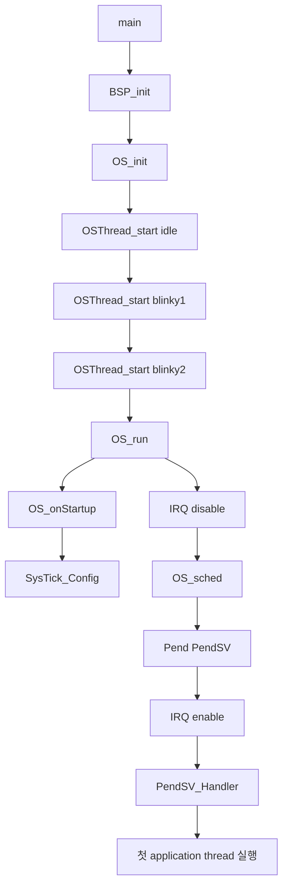
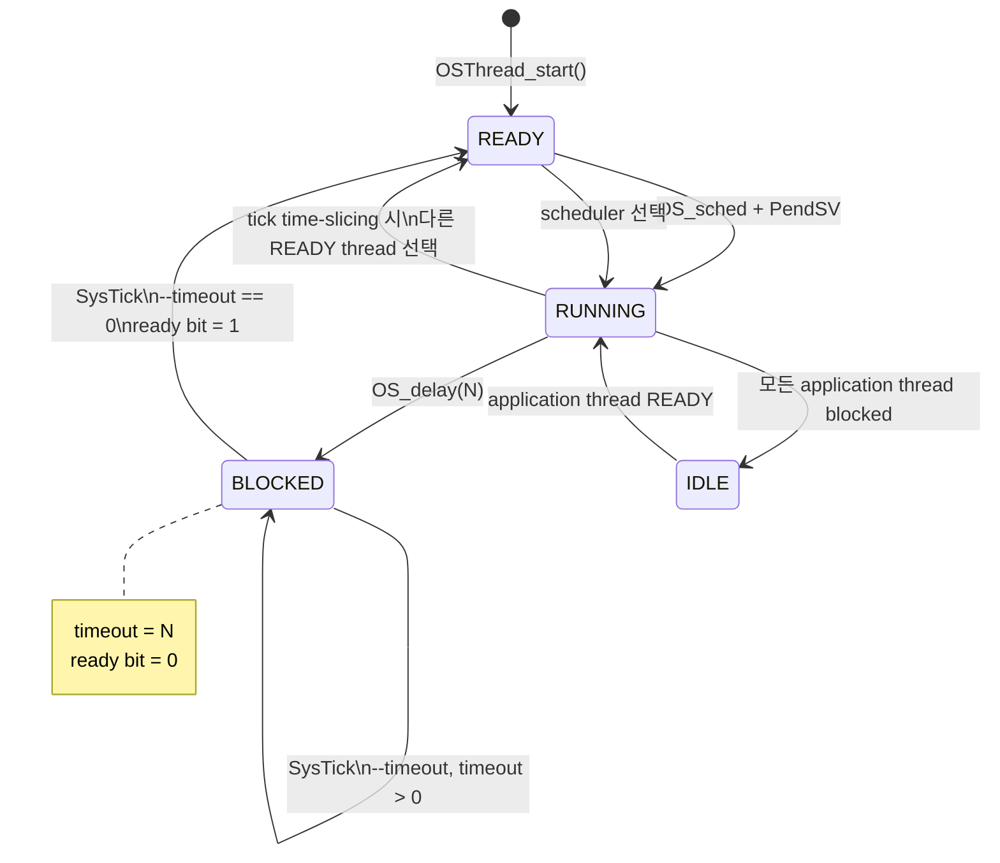
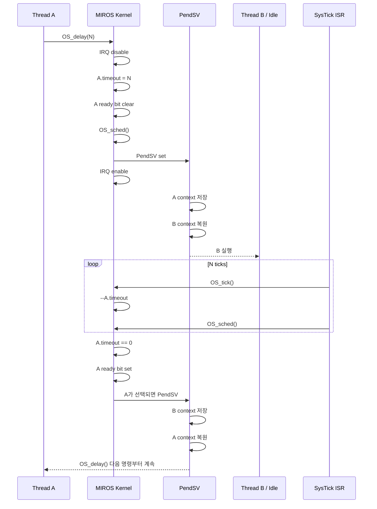
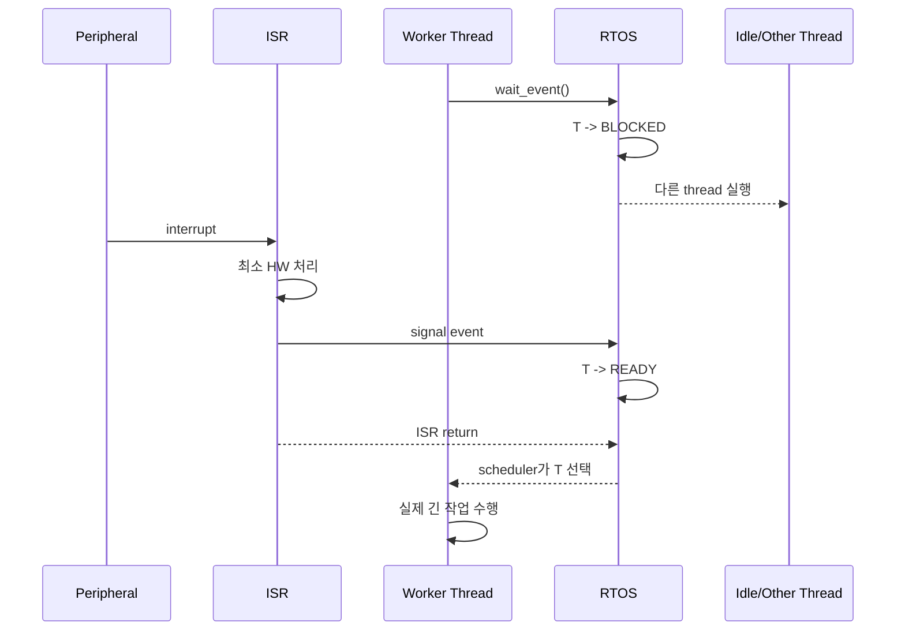

# RTOS의 블로킹 지연과 스레드 블로킹 — MIROS Lesson 25 코드 기반 심층 분석

## 실행 요약 및 핵심 결론

### Executive Summary

**확인된 사실:** Quantum Leaps의 `lesson-25/stm32c031-keil` 디렉터리는 정확히 `bsp.c`, `bsp.h`, `lesson.sct`, `lesson.uvoptx`, `lesson.uvprojx`, `main.c`, `miros.c`, `miros.h`, `qassert.h`의 9개 파일로 구성되어 있다. 이 중 RTOS의 핵심 동작은 거의 전부 `miros.c/.h`에 있고, `bsp.c/.h`가 SysTick과 idle hook을 MCU에 연결하며, `main.c`가 `OS_delay()`를 실제 스레드에서 사용하는 예제다. citeturn17view0turn17view1turn18view5

이 Lesson 25에서 가장 중요한 사실은 다음 한 문장으로 압축할 수 있다.

> **`OS_delay()`는 CPU를 지연시키는 함수가 아니라, 현재 스레드를 일정 시간 스케줄링 대상에서 제거하고 그 CPU를 다른 스레드 또는 idle thread에 넘기는 함수다.**

MIROS의 `OS_delay(ticks)`는 현재 스레드의 `timeout`을 설정하고, 그 스레드의 비트를 `OS_readySet`에서 지운 뒤 즉시 `OS_sched()`를 호출한다. 따라서 호출 스레드는 더 이상 READY가 아니며, PendSV를 통해 다른 스레드로 문맥 전환된다. 이후 SysTick ISR에서 `OS_tick()`이 `timeout`을 하나씩 감소시키다가 0이 되면 ready bit를 다시 세운다. 이것이 Lesson 25에서 구현된 **블로킹 지연(blocking delay)**의 본질이다. citeturn18view1turn18view2

ARM CMSIS-RTOS2의 표준적인 의미도 같다. `osDelay()`를 호출한 스레드는 BLOCKED 상태가 되고 즉시 context switch가 일어나며, 지정된 tick이 지나면 READY 상태로 되돌아간다. 즉 Quantum Leaps의 작은 MIROS 구현은 상용 RTOS의 기본적인 blocking-delay 개념을 매우 직접적인 형태로 보여준다. citeturn16view0

다만 **“이벤트 폴링을 `OS_delay()`로 바꾸면 항상 좋은가?”라는 질문의 답은 아니다.** 시간 자체를 기다리는 경우에는 `OS_delay()`가 busy wait보다 적절하지만, UART 수신, DMA 완료, ADC 완료, GPIO event와 같이 **이벤트 발생 시점이 불확실한 경우에는 이벤트가 올 때까지 thread를 semaphore, notification, queue, event flag 등에서 block시키는 것이 더 적절하다.** CMSIS-RTOS2 역시 delay뿐 아니라 mutex, semaphore, message queue, event/thread flag 대기 등을 BLOCKED 상태를 만드는 정상적인 수단으로 정의한다. citeturn16view1

따라서 초보 단계에서 다음 순서를 머릿속에 확실히 구분하는 것이 좋다.

| 상황 | 좋지 않은 방식 | 더 적절한 방식 |
|---|---|---|
| 정확히 100 ms 기다려야 함 | CPU busy-loop | `OS_delay()` |
| 센서가 준비될 때까지 기다림 | 1 ms마다 상태 polling | ISR → event/semaphore/notification → blocked thread |
| 10 ms마다 정확한 주기로 실행 | 매 작업 후 `OS_delay(10ms)` | absolute periodic delay (`DelayUntil`) |
| 아무 스레드도 할 일이 없음 | idle에서 무한 계산 | idle + `WFI`, 가능하면 tickless idle |
| ISR 안에서 기다림 | delay / blocking | **하지 않음**; ISR은 thread를 깨우고 종료 |

CMSIS는 delay API를 ISR에서 호출할 수 없다고 명시하고 있으며, FreeRTOS도 ISR용 notification API를 별도로 제공한다. 이는 ISR과 thread의 역할을 구분하는 중요한 RTOS 설계 원칙이다. citeturn16view0turn16view5

### 이번 코드에서 반드시 기억할 핵심

**확인된 사실**

`miros.h`의 TCB는 단 두 개의 주요 필드만 갖는다.

```c
typedef struct {
    void *sp;
    uint32_t timeout;
} OSThread;
```

즉 Lesson 25에는 별도의 `state` 변수조차 없다. READY/BLOCKED 상태는 `OS_readySet`의 bit와 `timeout` 값, 현재 실행 상태는 `OS_curr`에 의해 사실상 표현된다. `miros.h` 자체도 이 소프트웨어가 RTOS 개념 교육용이며 corner case, portability, error handling 등을 다루지 않아 일반적인 commercial application에는 권장되지 않는다고 명시한다. citeturn22view0

**코드 기반 추론**

Lesson 25의 상태를 개념적으로 표현하면 다음과 같다.

- `RUNNING`: 현재 `OS_curr`가 실제 CPU에서 수행되고 있는 상태
- `READY`: application thread의 ready bit가 `OS_readySet`에 설정된 상태
- `BLOCKED`: `OS_delay()`가 ready bit를 지웠으며 timeout이 만료되지 않은 상태
- `IDLE`: `OS_readySet == 0`일 때 특별히 thread index 0을 선택한 상태

이는 명시적인 enum state machine이 아니라 **코드 자료구조로부터 도출한 논리적 상태 모델**이다. citeturn18view0turn18view1

**불확실/지정되지 않은 사항**

Keil 프로젝트 파일에는 target CPU가 STM32C031C6Tx Cortex-M0+이고 `CLOCK(12000000)`이 기록되어 있지만, 실제 실행 시 `SystemCoreClock` 값은 `system_stm32c0xx.c`와 startup/clock initialization의 영향을 받는다. 그 파일들은 분석 대상 9개 파일의 외부 디렉터리에 있다. 따라서 **실제 CPU clock은 이 9개 파일만으로 확정하지 않고 unspecified로 취급하는 것이 정확하다.** 다만 RTOS tick은 `SystemCoreClock / BSP_TICKS_PER_SEC`로 설정되고 `BSP_TICKS_PER_SEC`가 100 Hz이므로, clock 정보가 정확히 갱신된다는 전제에서 RTOS의 의도된 tick period는 10 ms이다. citeturn20view0turn19view4turn18view6turn20view2

## 코드 기반 상세 분석

### 분석한 아홉 개 파일의 역할

9개 파일 모두를 기준으로 보면 RTOS 실행 경로와 직접 관련되는 정도가 명확히 갈린다. 디렉터리 자체에서 이 9개 파일을 확인할 수 있다. citeturn17view0

| 파일 | 역할 | Blocking/RTOS와의 관계 |
|---|---|---|
| `main.c` | application threads와 stack 정의, OS 시작 | `OS_delay()` 실제 사용 예제, blinky thread 생성 |
| `miros.h` | RTOS 공개 API와 TCB | `timeout`, `OS_delay`, `OS_tick`, `OS_sched` 정의 |
| `miros.c` | RTOS kernel 본체 | scheduler, ready set, timeout, idle, context switch 구현 |
| `bsp.c` | STM32 board/interrupt 연결 | SysTick ISR, `OS_onStartup`, `OS_onIdle`, `WFI` |
| `bsp.h` | BSP API/tick frequency | `BSP_TICKS_PER_SEC = 100U` |
| `qassert.h` | Design-by-Contract assertion | `OS_delay()`의 idle-thread 호출 금지 검증 |
| `lesson.uvprojx` | Keil 프로젝트 설정 | MCU, Cortex-M0+, memory, compiler, 외부 startup/system 파일 지정 |
| `lesson.sct` | linker scatter file | Flash/RAM/STACK 배치 |
| `lesson.uvoptx` | Keil debug option | target-debug/ST-Link 등의 개발환경 설정; RTOS 알고리즘에는 관여하지 않음 |

`lesson.uvprojx`는 STM32C031C6Tx, Cortex-M0+, 32 KB flash 영역과 12 KB RAM 영역을 지정하고 있으며, ST 공식 자료도 STM32C031C6가 Cortex-M0+ 기반이고 최대 48 MHz, 32 KB Flash, 12 KB SRAM을 갖는다고 설명한다. citeturn20view0turn16view7

`lesson.sct`에서는 Flash가 `0x08000000`부터 0x8000 bytes, RAM이 `0x20000000`에 위치하며, startup stack을 앞쪽에 배치한 후 나머지 RAM에 RW/ZI를 배치한다. 프로젝트 assembler 설정에는 `Stack_Size=2048`, `Heap_Size=0`도 들어 있다. citeturn19view5turn19view4

### 커널이 스레드를 어떻게 표현하는가

MIROS의 핵심 전역 상태는 다음 구조다.

```c
OSThread * volatile OS_curr;
OSThread * volatile OS_next;

OSThread *OS_thread[32 + 1];
uint8_t OS_threadNum;
uint8_t OS_currIdx;
uint32_t OS_readySet;

OSThread idleThread;
```

`OS_thread[0]`은 idle thread이며, application thread들은 index 1부터 등록된다. application thread의 READY 여부를 32-bit `OS_readySet`의 각 bit 하나로 나타내므로 구조적으로 최대 32개의 application thread가 표현 가능하다. citeturn18view0turn18view3

여기서 가장 중요한 구조는 다음과 같다.

```text
OS_thread[0]       = idle
OS_thread[1]       = blinky1       OS_readySet bit 0
OS_thread[2]       = blinky2       OS_readySet bit 1
OS_thread[3]       = blinky3       OS_readySet bit 2
...
```

idle에는 ready bit가 없다. 대신 scheduler가 다음 조건을 특별 취급한다.

```c
if (OS_readySet == 0U) {
    OS_currIdx = 0U;
}
```

즉 **idle thread는 다른 application thread와 경쟁하는 정상 READY thread라기보다 “아무도 준비되지 않았을 때의 fallback execution context”이다.** citeturn18view0

이것은 RTOS 설계에서 idle thread가 필요한 이유를 아주 직관적으로 보여준다. scheduler가 실행할 application thread가 한 개도 없어도 CPU가 돌아갈 합법적인 context 하나는 항상 존재해야 하기 때문이다. FreeRTOS 역시 scheduler가 실행할 다른 task가 없을 때 idle task를 실행하는 구조를 갖는다. citeturn16view2

### 스레드 생성과 READY 상태

`OSThread_start()`는 새 스레드의 stack 위에 초기 exception frame을 인위적으로 만들어 놓는다. xPSR, PC, LR, R12, R3~R0와 R4~R11을 stack에 구성한 후 `me->sp`에 stack pointer를 저장한다. 이어 unused stack을 `0xDEADBEEF`로 채우고 thread table에 등록한다. application thread이면 ready bit도 세운다. citeturn18view2turn18view3

핵심 부분만 단순화하면 다음과 같다.

```c
OS_thread[OS_threadNum] = me;

if (OS_threadNum > 0U) {
    OS_readySet |= (1U << (OS_threadNum - 1U));
}

++OS_threadNum;
```

따라서 `OSThread_start()` 직후 application thread는 아직 CPU를 실행하고 있지는 않아도 **READY**다. citeturn18view3

### OS 시작 과정

`main.c`는 다음 순서로 실행한다.

```c
BSP_init();

OS_init(stack_idleThread, sizeof(stack_idleThread));

OSThread_start(&blinky1, ...);
OSThread_start(&blinky2, ...);

/* blinky3 start는 주석 처리 */

OS_run();
```

따라서 현재 repository 상태에서 실제 등록되는 thread는 idle, blinky1, blinky2의 세 개다. `blinky3`의 stack과 TCB 변수는 존재하지만 `OSThread_start()` 호출은 주석 처리되어 있으므로 scheduler에 등록되지 않는다. citeturn17view1

전체 초기 호출 그래프를 그리면 다음과 같다.



`OS_run()`은 먼저 `OS_onStartup()`을 호출한 뒤 interrupt를 막고 `OS_sched()`를 실행한다. scheduler가 `OS_next`를 결정하고 PendSV를 pending시킨 뒤 interrupt를 다시 허용하면 PendSV handler가 실제 context switch를 수행한다. citeturn18view1turn22view1

### scheduler가 READY thread를 선택하는 방식

이 MIROS에는 thread priority field가 없다. TCB에는 `sp`와 `timeout`만 있고 scheduler는 `OS_currIdx`를 증가시키며 `OS_readySet`에서 다음 set bit를 찾는다. 따라서 Lesson 25의 scheduling policy는 application thread들 사이의 **round-robin**이다. citeturn22view0turn18view0turn18view1

개념적으로 다음과 같다.

```c
if (ready 없음) {
    next = idle;
}
else {
    do {
        다음 thread index로 이동;
    } while (그 thread가 READY가 아님);

    next = 그 READY thread;
}

if (next != current) {
    OS_next = next;
    PendSV 요청;
}
```

특히 SysTick ISR은 매 tick마다 `OS_sched()`를 실행한다.

```c
void SysTick_Handler(void) {
    OS_tick();

    __disable_irq();
    OS_sched();
    __enable_irq();
}
```

따라서 여러 application thread가 동시에 READY인 상태라면 tick마다 round-robin 선택이 진행될 수 있다. 의도된 tick frequency가 100 Hz이므로 명목상 scheduler decision point는 10 ms 간격이다. citeturn18view5turn20view2

이 부분은 FreeRTOS나 CMSIS-RTOS의 전형적인 **priority-based preemptive scheduler와 중요한 차이**가 있다. CMSIS-RTOS2에서는 READY 상태 중 가장 높은 우선순위의 thread가 RUNNING이 되는 모델을 정의하며, 더 높은 우선순위 thread가 READY가 되면 즉시 switch될 수 있다. MIROS Lesson 25에는 그러한 thread priority 개념 자체가 없다. citeturn16view1turn22view0

따라서 Liu와 Layland의 고전적인 hard real-time scheduling 연구처럼 fixed-priority/preemptive periodic scheduling을 분석하는 이론을 Lesson 25의 scheduler에 그대로 적용하면 안 된다. 해당 논문은 single-processor hard real-time periodic scheduling에서 priority-driven scheduling을 분석한 고전 연구지만, Lesson 25는 교육 목적으로 단순화된 round-robin kernel이다. citeturn21search0turn21search7turn18view0

### `OS_delay()`가 실제로 하는 일

핵심 함수 전체는 매우 작다.

```c
void OS_delay(uint32_t ticks) {
    __asm volatile ("cpsid i");

    Q_REQUIRE(OS_curr != OS_thread[0]);

    OS_curr->timeout = ticks;

    OS_readySet &= ~(1U << (OS_currIdx - 1U));

    OS_sched();

    __asm volatile ("cpsie i");
}
```

원본 코드는 정확히 이 순서로 동작한다. citeturn18view1turn18view2

각 줄의 의미를 상태 관점에서 해석하면 다음과 같다.

| 코드 | 의미 |
|---|---|
| `cpsid i` | kernel 자료구조 변경 중 interrupt 경쟁 방지 |
| `Q_REQUIRE(...)` | idle thread에서는 delay 금지 |
| `timeout = ticks` | 언제 READY로 돌아올지 down-counter 설정 |
| ready bit clear | 현재 thread를 runnable 집합에서 제거 |
| `OS_sched()` | 다른 runnable thread 또는 idle 선택 |
| `cpsie i` | interrupt 재허용 → pending PendSV 실행 가능 |

특히 `OS_delay()` 안에는 다음과 같은 코드가 **없다.**

```c
while (timeout != 0) {
    /* wait */
}
```

따라서 이것은 busy waiting이 아니다. CPU가 `OS_delay()` 내부에서 시간을 소비하는 것이 아니라 **현재 thread의 실행 자체가 중단된다.** citeturn18view2

### BLOCKED → READY를 만드는 `OS_tick()`

SysTick ISR에서 호출되는 `OS_tick()`은 application thread 전체를 순회한다.

```c
for (n = 1U; n < OS_threadNum; ++n) {
    if (OS_thread[n]->timeout != 0U) {
        --OS_thread[n]->timeout;

        if (OS_thread[n]->timeout == 0U) {
            OS_readySet |= (1U << (n - 1U));
        }
    }
}
```

index 1부터 시작하므로 idle thread의 timeout은 검사하지 않는다. timeout이 0이 되는 바로 그 tick에 ready bit가 다시 설정된다. citeturn18view1

따라서 `OS_delay(N)`의 상태 전이는 다음과 같이 볼 수 있다.



**중요:** 위의 BLOCKED/READY/RUNNING은 이해를 위한 논리적 모델이다. MIROS TCB 안에는 실제 `state` enum이 존재하지 않는다. citeturn22view0turn18view0turn18view1

### PendSV가 실제 context switch를 수행한다

`OS_sched()` 자체는 stack을 교체하지 않는다. 다음 thread를 `OS_next`에 저장하고 Cortex-M의 PendSV를 pending시킬 뿐이다.

```c
if (next != OS_curr) {
    OS_next = next;
    *(uint32_t volatile *)0xE000ED04 = (1U << 28);
}
```

실제 switch는 `PendSV_Handler()`가 수행한다. 현재 thread가 있다면 R4~R11을 current stack에 저장하고 그 SP를 `OS_curr->sp`에 보관한 뒤, `OS_next->sp`를 새 SP로 가져와 registers를 복원하고 exception return한다. Cortex-M0+의 ARMv6-M 특성에 맞춰 high register R8~R11은 low register를 경유해 저장/복원한다. citeturn18view1turn22view1


따라서 `OS_delay()`가 “return한다”는 표현도 주의가 필요하다. 함수 호출 직후 논리적으로 return하는 것이 아니라 context switch로 thread가 멈춘 뒤, 나중에 그 thread가 다시 선택되어 stack/register context가 복원되었을 때 **그 thread의 관점에서 `OS_delay()` 호출 다음 줄로 계속 진행한다.** 이것이 blocking API가 보통 synchronous 함수처럼 보이면서도 CPU를 점유하지 않는 이유다. citeturn18view2turn22view1

### `OS_delay()` 전체 시퀀스



ARM CMSIS-RTOS2가 설명하는 `osDelay()`의 동작 역시 delayed thread를 BLOCKED로 전환하고 context switch한 뒤 timeout 후 READY로 돌린다는 동일한 큰 구조를 갖는다. citeturn16view0

### 실제 blinky thread에서의 시간 흐름

`BSP_TICKS_PER_SEC`는 100이다. 따라서 의도된 tick period는 10 ms다. citeturn20view2turn18view6

`blinky1`은 다음과 같다.

```c
BSP_ledGreenOn();
OS_delay(BSP_TICKS_PER_SEC / 4U);       // 25 ticks

BSP_ledGreenOff();
OS_delay(BSP_TICKS_PER_SEC * 3U / 4U); // 75 ticks
```

따라서 명목상 LED ON 250 ms + OFF 750 ms로 약 1초 주기를 형성한다. citeturn17view1turn20view2

`blinky2`는 다음과 같다.

```c
BSP_ledBlueOn();
OS_delay(BSP_TICKS_PER_SEC / 2U);  // 50 ticks

BSP_ledBlueOff();
OS_delay(BSP_TICKS_PER_SEC / 3U);  // 33 ticks
```

integer arithmetic 때문에 `100 / 3`은 33 tick이다. 따라서 명목상 500 ms + 330 ms, 즉 약 830 ms cycle이다. 다만 이 STM32C031 BSP의 blue LED functions는 실제로 no-op으로 구현되어 있어 blinky2는 scheduler 실험용 thread 역할만 한다. citeturn17view1turn18view5

명목상 초기 흐름을 단순화하면 다음과 같다.

```text
시간        blinky1               blinky2                CPU
-------------------------------------------------------------------
t≈0         GREEN ON
            delay(25)                                    switch

            BLOCKED               BLUE ON
                                  delay(50)               switch

0~250 ms    BLOCKED               BLOCKED                IDLE

≈250 ms     READY
            GREEN OFF
            delay(75)             BLOCKED                IDLE

≈500 ms     BLOCKED               READY
                                  BLUE OFF
                                  delay(33)               IDLE

≈830 ms     BLOCKED               READY
                                  BLUE ON ...
```

단, 이것은 개념적 timing이다. `OS_delay(N)`은 tick boundary에 맞춰 시작되는 것이 아니므로 실제 wall-clock delay는 호출 시점과 다음 SysTick 사이의 위상에 따라 달라질 수 있고, READY가 되었다고 해서 반드시 같은 순간에 CPU를 얻는 것도 아니다. ARM CMSIS 문서도 tick 기반 delay가 호출 위치에 따라 최대 약 한 tick의 양자화 차이를 가질 수 있음을 명시한다. citeturn16view0

### idle thread는 언제 동작하는가

idle thread는 매우 단순하다.

```c
void main_idleThread() {
    while (1) {
        OS_onIdle();
    }
}
```

그리고 scheduler는 `OS_readySet == 0`일 때 index 0, 즉 idle을 선택한다. citeturn18view0

따라서 blinky1과 blinky2가 모두 `OS_delay()` 상태라면 CPU는 idle로 이동한다.

이것이 blocking의 RTOS적 가치다.

```text
Busy polling:
Thread A ██████████████████████████████
Thread B 거의 못 씀
Idle     없음

Blocking:
Thread A ████........██........
Thread B ....████........██....
Idle     ........████........██
```

점(`.`)은 해당 thread가 CPU를 소비하지 않는 BLOCKED 상태를 의미한다. MIROS에서 실제 READY/BLOCKED 판별은 ready bit와 timeout으로 이루어진다. citeturn18view0turn18view1

### idle과 저전력은 같은 개념이 아니다

여기에는 매우 중요한 함정이 하나 있다.

`bsp.c`의 idle callback은 다음과 같다.

```c
void OS_onIdle(void) {
#ifdef NDBEBUG
    __WFI();
#endif
}
```

즉 `NDBEBUG`가 정의된 경우에만 `__WFI()`가 실행된다. citeturn18view6

그런데 checked-in Keil `dbg` target의 C compiler `<Define>` 필드는 비어 있다. 따라서 **제공된 프로젝트 설정 그대로라면 `NDBEBUG`를 외부에서 별도로 주입하지 않는 한 `__WFI()` 부분은 컴파일되지 않는다.** 그 경우 application thread들은 훌륭하게 block되지만 idle thread가 빈 loop를 계속 돌기 때문에 실제 CPU 전력 절감 효과는 제한적이다. citeturn22view3

여기서 `NDBEBUG`라는 이름이 표준 `NDEBUG`와 다른 이유가 의도적인 course convention인지 단순 표기 문제인지는 이 9개 파일만으로 확인되지 않는다. 따라서 이는 **불확실 사항**으로 남겨야 한다. citeturn18view6turn22view3

상용 RTOS에서는 한 단계 더 나아가, 장시간 모든 application task가 blocked라면 주기적인 tick 자체도 일시적으로 멈추는 **tickless idle**을 사용하기도 한다. FreeRTOS는 이를 low-power support 기능으로 제공한다. citeturn16view3

## 초보자를 위한 구체적인 설명

### Blocking을 “사람이 줄 서는 것”으로 생각하라

CPU가 한 명의 작업자라고 생각해 보자.

Thread A의 일이 다음과 같다고 하자.

```text
LED 켜기
1초 기다리기
LED 끄기
```

busy waiting은 이렇다.

> Thread A: “난 1초 동안 아무것도 안 할 건데 작업자는 계속 내 옆에서 시계만 봐.”

그러면 CPU가 다음처럼 된다.

```text
Thread A: [LED ON][----------- 1초 동안 CPU 점유 -----------][LED OFF]
Thread B:             실행 기회가 제한됨
```

blocking은 다르다.

> Thread A: “1초 뒤에 나를 다시 READY 목록에 넣어 줘. 그동안 난 작업자를 쓰지 않을게.”

```text
Thread A: [LED ON][        BLOCKED        ][LED OFF]
CPU:      [A][B][C][Idle][B][C][Idle]...[A]
```

ARM의 공식 RTOS 모델에서도 delay된 thread는 BLOCKED가 되며, timeout이 지나면 READY가 된다. citeturn16view0turn16view1

### READY와 RUNNING은 다르다

초보자가 특히 많이 헷갈리는 부분이다.

**READY는 “실행할 수 있다”이지 “실행 중이다”가 아니다.**

예를 들어 세 thread가 있다고 하자.

```text
A = READY
B = RUNNING
C = READY
```

CPU core가 하나라면 실제 실행되는 thread는 하나다. A와 C는 조건상 실행 가능하지만 scheduler가 CPU를 줄 때까지 기다린다. CMSIS-RTOS의 공식 상태 모델도 RUNNING thread는 단일 core에서 한 번에 하나이며 READY thread들은 실행 가능하지만 아직 실행 중이 아닌 상태로 설명한다. citeturn16view1

반면:

```text
A = BLOCKED (timeout 20)
B = RUNNING
C = READY
```

A는 scheduler가 아무리 골라주고 싶어도 선택 대상이 아니다.

MIROS에서는 이것이 바로:

```c
OS_readySet &= ~A_BIT;
```

로 구현된다. citeturn18view2

### `OS_delay()`에서 시간이 흐르는 장소는 어디인가

매우 중요한 질문이다.

다음 코드가 있다고 하자.

```c
GPIO_ON();
OS_delay(100);
GPIO_OFF();
```

초보자는 `OS_delay()` 내부에서 이렇게 돌아갈 것으로 생각하기 쉽다.

```c
while (counter != 0) {
    counter--;
}
```

하지만 MIROS는 그렇지 않다.

실제 timeout 감소는 **SysTick ISR**의 `OS_tick()`이 한다.

```text
Thread:
OS_delay(100)
  ↓
나 BLOCKED 할게

SysTick #1  → timeout 99
SysTick #2  → timeout 98
SysTick #3  → timeout 97
...
SysTick #100 → timeout 0 → READY
```

그 사이 CPU는 다른 thread를 수행한다. citeturn18view1turn18view5

따라서 가장 중요한 정신 모델은:

> **시간을 세는 주체는 RTOS tick이고, 기다리는 thread는 그 시간을 직접 세지 않는다.**

### ISR과 thread는 역할이 다르다

ISR을 “초인종을 듣는 사람”이라고 생각하면 이해하기 쉽다.

UART byte가 들어오면:

```text
UART hardware
     ↓
UART ISR
     ↓
데이터/상태 최소 처리
     ↓
"Thread RX, 일어날 일이 생겼어"
     ↓
ISR 종료

RX Thread
     ↓
READY / RUNNING
     ↓
무거운 parsing 처리
```

이 방식에서는 RX thread가 data가 없을 때 BLOCKED되어 CPU를 쓰지 않는다. CMSIS-RTOS2의 thread state 모델에서도 event 대기는 BLOCKED 상태의 정상적인 원인이며, FreeRTOS에는 ISR에서 task를 깨우기 위한 `xTaskNotifyFromISR()` 계열 API가 별도로 존재한다. citeturn16view1turn16view5

반대로 다음은 좋지 않은 형태다.

```c
void uart_thread(void) {
    for (;;) {
        if (UART_RX_READY()) {
            process();
        }

        OS_delay(1);
    }
}
```

이것은 busy polling보다는 CPU 소비가 적어질 수 있지만 여전히 **10 ms마다 “왔나?” 하고 불필요하게 깨는 polling**이다. 이벤트가 발생한 순간 바로 처리하지 못하고 최대 polling interval만큼 latency도 생긴다.

더 나은 개념은:

```c
void uart_thread(void) {
    for (;;) {
        wait_for_uart_event();   // BLOCKED
        process_received_data();
    }
}
```

이다. CMSIS에서도 thread flag, event flag, semaphore, queue 등의 wait operation들이 thread를 BLOCKED시킬 수 있다. citeturn16view1

### 따라서 delay blocking과 event blocking을 구분해야 한다

둘 다 BLOCKED지만 **깨우는 원인이 다르다.**

```text
시간 기반 blocking
------------------
Thread
  |
OS_delay(50)
  |
BLOCKED
  |
50 ticks 경과
  |
READY


이벤트 기반 blocking
--------------------
Thread
  |
SemaphoreTake()
  |
BLOCKED
  |
Peripheral ISR -> SemaphoreGive
  |
READY
```

이 차이는 앞으로 RTOS를 공부할 때 매우 중요하다. CMSIS-RTOS2도 delayed, event wait, mutex/semaphore wait, message queue wait 등을 모두 BLOCKED의 서로 다른 원인으로 취급한다. citeturn16view1

### 왜 blocking이 RTOS 설계를 바꾸는가

단순한 super-loop polling 설계에서는 흔히 다음 구조가 된다.

```c
for (;;) {
    poll_uart();
    poll_button();
    poll_adc();
    poll_motor();
    delay_somehow();
}
```

모든 subsystem의 responsiveness가 이 loop의 전체 실행시간에 얽힌다.

RTOS blocking을 사용하면 구조가 달라진다.

```text
UART Thread  ── waits UART event
ADC Thread   ── waits ADC/DMA event
Control      ── waits periodic timer
Logger       ── waits queue
Idle         ── runs only when everyone blocked
```

즉 “CPU를 계속 훑는 구조”에서 “일이 생긴 thread만 READY가 되는 구조”로 변한다. CMSIS가 READY/BLOCKED 상태와 다양한 wait primitive를 RTOS thread model의 핵심으로 정의하는 이유도 이 구조와 연결된다. citeturn16view1

### RTOS에서 blocking은 나쁜 것이 아니다

일반 PC 프로그래밍을 처음 배울 때 “blocking function”이라는 표현이 부정적으로 들릴 수 있다.

하지만 RTOS에서는 **적절한 blocking은 정상적이며 매우 중요한 메커니즘**이다.

문제는 “무엇을 block하는가”이다.

```text
좋은 blocking
Thread를 block
→ CPU는 다른 thread 사용

나쁜 busy wait
CPU를 붙잡고 기다림
→ 다른 thread에게 CPU를 넘기지 않음
```

즉:

> **RTOS에서 좋은 기다림은 CPU를 기다리게 만드는 것이 아니라 thread를 기다리게 만든다.**

CMSIS의 `osDelay()`가 바로 delayed thread를 BLOCKED로 옮기고 즉각적인 context switch를 수행하는 이유다. citeturn16view0

## 위험 요소와 한계, 구현 예시

### 가장 위험한 코드 결함: `OS_delay(0)`

이 Lesson 25의 `OS_delay()`에는 `ticks > 0` 검사가 없다.

```c
OS_curr->timeout = ticks;
OS_readySet &= ~current_bit;
```

그리고 `OS_tick()`은 다음 조건에서만 timeout을 감소시킨다.

```c
if (OS_thread[n]->timeout != 0U) {
    --OS_thread[n]->timeout;
    ...
}
```

따라서:

```c
OS_delay(0);
```

을 호출하면:

```text
timeout = 0
ready bit = 0
        ↓
OS_tick(): timeout == 0이므로 아무 작업 안 함
        ↓
ready bit가 다시 설정될 경로 없음
        ↓
그 thread는 영구적으로 block
```

된다. 이는 소스 코드에서 직접 도출되는 **확인된 결함/미처리 corner case**다. MIROS 자체가 corner case/error handling을 목적으로 하지 않는 teaching aid라고 명시한 것과도 일치한다. ARM CMSIS-RTOS2의 `osDelay()`는 0 tick을 invalid parameter로 정의한다. citeturn18view2turn22view0turn16view0

학습 목적으로 가장 작은 수정은 다음과 같다.

```c
void OS_delay(uint32_t ticks) {
    __disable_irq();

    Q_REQUIRE(OS_curr != OS_thread[0]);
    Q_REQUIRE(ticks > 0U);

    OS_curr->timeout = ticks;
    OS_readySet &= ~(1U << (OS_currIdx - 1U));

    OS_sched();

    __enable_irq();
}
```

이는 MIROS의 기존 구조를 바꾸지 않고 zero-delay 문제만 방어하는 surgical change다. `Q_REQUIRE`는 `qassert.h`에서 precondition assertion으로 정의되어 있다. citeturn20view3turn18view2

### ISR에서 `OS_delay()`를 호출하면 안 된다

MIROS의 함수에는 “ISR인지 아닌지”를 검사하는 명시적 guard가 없다.

그러나 구현은:

```c
OS_curr->timeout = ticks;
OS_readySet &= ~(1U << (OS_currIdx - 1U));
```

처럼 **현재 thread context를 변경한다.** 따라서 ISR 자체를 block시키는 개념으로 설계되어 있지 않다. 이는 코드 구조에서 도출되는 결론이다. citeturn18view2

ARM CMSIS-RTOS2는 이 부분을 명시적으로 규정하여 `osDelay()`와 `osDelayUntil()`을 ISR에서 호출할 수 없다고 한다. citeturn16view0

따라서:

```c
void UART_IRQHandler(void) {
    OS_delay(10);    // 하지 말 것
}
```

이 아니라 개념적으로:

```c
void UART_IRQHandler(void) {
    /* hardware interrupt acknowledge */
    /* 최소 데이터 보존 */
    /* waiting thread에 event 전달 */
}
```

이 되어야 한다.

상용 RTOS에서는 ISR용 API를 별도로 사용한다. 예를 들어 FreeRTOS에는 `xTaskNotifyFromISR()` 계열 API가 있다. citeturn16view5

### 고정 delay를 event polling 대체용으로 남용하지 말 것

다음 코드:

```c
for (;;) {
    if (device_ready()) {
        process_device();
    }

    OS_delay(1);
}
```

는 busy-loop보다는 CPU 점유를 낮추지만 여전히 polling이다.

100 Hz tick이라면 `OS_delay(1)`은 약 10 ms 단위로 상태를 재검사하므로:

```text
device ready
   |
   |<------ 최대 약 polling interval ------>|
                                            thread 확인
```

과 같은 event latency가 생길 수 있다. 실제 tick-based delay는 tick boundary에 따라 추가적인 양자화 영향을 받는다. citeturn20view2turn16view0

이벤트가 ISR로 검출 가능한 경우에는:

```c
for (;;) {
    event_wait();        // event가 없으면 BLOCKED
    process_device();
}
```

가 올바른 목표 구조다. CMSIS 역시 thread/event flags, semaphore, message queue 등의 wait를 BLOCKED-state mechanism으로 정의한다. citeturn16view1

### 상대 delay는 정확한 주기 실행에서 drift를 만든다

다음 주기 thread를 생각해 보자.

```c
for (;;) {
    do_work();        // 3 ms 걸림
    OS_delay(100);    // 100 ms
}
```

이것은 “100 ms마다 수행”이 아니다.

개념적으로:

```text
3 ms work + 100 ms wait
≈ 103 ms period
```

이고, scheduling latency와 tick quantization도 추가될 수 있다.

FreeRTOS가 `vTaskDelayUntil()`을 별도로 제공하는 이유도 periodic task가 일정한 실행 주기를 유지할 수 있게 하기 위해서다. 공식 문서에서 `vTaskDelayUntil()`은 periodic task의 constant execution frequency를 위한 API로 설명된다. citeturn16view4

MIROS Lesson 25에는 `OS_delayUntil()`에 해당하는 absolute-time periodic delay가 없다. 공개 API에는 `OS_delay()`와 `OS_tick()`만 있다. citeturn22view0

따라서 교육용 다음 단계로는 이런 개념을 배우는 것이 좋다.

```c
uint32_t next = OS_tickCount();

for (;;) {
    next += PERIOD_TICKS;

    do_work();

    OS_delayUntil(next);
}
```

위 코드는 Lesson 25에 존재하는 코드가 아니라 **향후 구현 개념 예시**다. CMSIS의 `osDelayUntil()`도 absolute tick time을 사용해 동일한 목적을 제공하며, tick counter overflow case까지 처리하도록 정의된다. citeturn16view0

### READY가 되었다고 즉시 RUNNING인 것은 아니다

예를 들어:

```text
timeout expires
       ↓
ready bit = 1
       ↓
READY
```

까지는 확실하다.

그러나 다음 단계는 scheduler 정책에 달려 있다.

CMSIS의 priority-based RTOS라면 더 높은 priority thread가 READY가 된 경우 즉시 preemption될 수 있다. citeturn16view1

반면 Lesson 25의 MIROS는 priority가 없고 round-robin index scan을 사용한다. 따라서 thread가 timeout에서 풀렸다고 해서 “무조건 가장 먼저 실행된다”라고 설명하면 틀린다. scheduler가 다음 ready index로 선택해야 RUNNING이 된다. citeturn18view0turn18view1

정확한 표현은:

> **timeout expiration은 BLOCKED → READY를 만든다. READY → RUNNING은 scheduler가 결정한다.**

이다.

### tick 기반 delay에는 시간 해상도 한계가 있다

이 프로젝트에서 의도한 tick은 100 Hz, 즉 10 ms resolution이다. citeturn20view2turn18view6

따라서:

```text
OS_delay(1)
```

이 “정확히 10.000 ms sleep”이라는 뜻은 아니다.

thread가 tick 직전에 delay하면 다음 SysTick이 거의 즉시 발생하여 첫 decrement를 수행할 수 있다. ARM CMSIS 문서도 `osDelay(1)`을 다음 tick 직전에 호출하면 실제 delay가 1 tick보다 짧아질 수 있다고 명시한다. citeturn16view0

개념적으로:

```text
Tick          Tick          Tick
 |-------------|-------------|
               ^
              delay(1)
              거의 직후 호출
```

과

```text
Tick          Tick          Tick
 |-------------|-------------|
 ^ delay(1)
```

은 실제 기다리는 wall time이 다르다.

그리고 READY가 된 이후에도 다른 READY thread 때문에 실행이 더 늦어질 수 있다. 따라서 RTOS delay를 hardware timer 수준의 정밀 pulse generation 용도로 사용해서는 안 된다.

### scheduler와 tick 비용이 thread 수에 따라 증가한다

`OS_tick()`은 매 tick마다:

```c
for (n = 1U; n < OS_threadNum; ++n)
```

으로 모든 application thread를 검사한다. 따라서 이 구현의 tick processing cost는 thread 수에 대해 대략 O(N)이다. citeturn18view1

scheduler도 ready thread를 찾을 때:

```c
do {
    ++OS_currIdx;
    ...
} while (ready bit가 없음);
```

으로 scan하므로 worst case에서 thread 수에 비례하는 탐색을 수행한다. citeturn18view0turn18view1

Lesson 25의 최대 32 application threads 규모에서는 교육용으로 매우 단순하고 이해하기 좋은 구조지만, thread 수와 tick frequency가 커지면 ISR cost와 scheduler cost를 분석해야 한다.

특히 hard real-time 시스템에서는 “평균적으로 빠르다”가 아니라:

```text
최악의 SysTick 실행 시간
+
최악의 critical-section 시간
+
context-switch latency
+
higher-priority ISR interference
```

등을 기준으로 timing을 검증해야 한다. Hard real-time scheduling에서 실행시간, 주기, deadline, priority 간 관계를 분석해야 한다는 점은 Liu–Layland의 고전 연구가 체계화한 핵심 주제다. citeturn21search0turn21search7

### interrupt disable 구간도 설계 비용이다

`OS_delay()`는:

```c
cpsid i;
...
OS_sched();
cpsie i;
```

이고, `OS_sched()` 역시 header에서 “interrupts DISABLED 상태에서 호출해야 함”이라고 계약되어 있다. PendSV context switch도 register 저장/복원 중 interrupt를 disable한다. citeturn18view2turn22view0turn22view1

장점은 shared kernel state:

```text
timeout
readySet
currIdx
OS_next
```

를 일관성 있게 변경할 수 있다는 것이다.

반면 단점은 global interrupt masking 시간만큼 interrupt latency가 증가할 수 있다는 것이다.

즉 RTOS kernel에서 critical section은:

> **정확성을 얻는 대신 interrupt latency budget을 소비하는 구간**

으로 생각해야 한다.

### idle thread를 절대로 일반 thread처럼 block시키면 안 되는 이유

`OS_delay()`에는:

```c
Q_REQUIRE(OS_curr != OS_thread[0]);
```

가 들어 있다. `Q_REQUIRE`는 precondition assertion이다. citeturn18view2turn20view3

왜 idle은 delay할 수 없을까?

이 구현에서는 application ready set이 0이면:

```c
OS_currIdx = 0;
```

으로 idle을 **무조건 실행할 fallback**으로 가정한다. citeturn18view0

그런데 idle까지 block시키면:

```text
application READY = 없음
idle = BLOCKED
------------------
실행 가능한 context = 없음
```

이 되어 kernel의 기본 가정 자체가 깨진다.

따라서 idle은:

```c
for (;;) {
    OS_onIdle();
}
```

처럼 항상 runnable해야 한다. 필요하면 그 안에서 CPU를 `WFI` 같은 low-power state로 보내되, **RTOS 관점에서는 idle context 자체가 없어진 것이 아니다.** citeturn18view0turn18view6

### WFI와 blocking을 혼동하지 말 것

두 개는 전혀 다른 층의 개념이다.

```text
OS_delay()
   ↓
Thread가 BLOCKED
   ↓
scheduler가 다른 thread 선택
```

반면:

```text
Idle thread 실행
   ↓
OS_onIdle()
   ↓
__WFI()
   ↓
CPU core가 interrupt까지 sleep
```

이다. MIROS BSP는 조건부로 `__WFI()`를 사용한다. citeturn18view6

즉:

> `OS_delay()` = **thread scheduling state 변화**

> `WFI` = **processor power/execution state 변화**

다.

블로킹만 구현해도 concurrency와 CPU scheduling 효율은 좋아지지만, 저전력까지 자동으로 얻는 것은 아니다.

### 작은 개선 예시

Lesson 25의 교육적 구조를 유지하면서 blocking delay API에 최소한의 precondition을 강화한다면 다음 정도가 적절하다.

```c
void OS_delay(uint32_t ticks) {
    __disable_irq();

    /* thread context only */
    Q_REQUIRE(OS_curr != OS_thread[0]);

    /* zero would never be reactivated by OS_tick() */
    Q_REQUIRE(ticks > 0U);

    OS_curr->timeout = ticks;

    /* RUNNING/READY -> BLOCKED */
    OS_readySet &= ~(1U << (OS_currIdx - 1U));

    OS_sched();

    __enable_irq();
}
```

이 수정은 Lesson 25의 알고리즘 자체를 바꾸지 않으면서 실제 source에서 발견되는 `OS_delay(0)` 영구 block corner case를 막는다. 원본 MIROS가 corner-case handling을 의도적으로 최소화한 teaching aid라는 점도 함께 기억해야 한다. citeturn18view2turn22view0

### 이벤트 polling을 실제 RTOS 구조로 바꾸는 예

초기 단계:

```c
void sensor_thread(void) {
    for (;;) {
        if (sensor_ready()) {
            read_sensor();
        }
    }
}
```

CPU를 계속 사용한다.

다음 단계:

```c
void sensor_thread(void) {
    for (;;) {
        if (sensor_ready()) {
            read_sensor();
        }

        OS_delay(1U);
    }
}
```

CPU를 계속 붙잡지는 않지만 polling은 계속한다.

최종 목표 개념은:

```c
void SENSOR_IRQHandler(void) {
    clear_sensor_irq();

    /* RTOS-specific FromISR signal */
    signal_sensor_thread_from_isr();
}

void sensor_thread(void) {
    for (;;) {
        wait_sensor_event();     /* thread BLOCKED */
        read_sensor();
    }
}
```

이다.

CMSIS의 thread/event flag나 semaphore/message queue wait가 이러한 event-driven blocking의 공식적인 예이고, FreeRTOS의 `xTaskNotifyFromISR()`은 ISR에서 task notification을 전달하는 API의 한 예다. citeturn16view1turn16view5

이 구조를 한 그림으로 압축하면:



**이 구조가 “비효율적인 polling을 RTOS blocking으로 교체한다”는 목표의 최종 형태다.**

## 최종 추천

### 학습 순서는 `OS_delay()`에서 시작하되 거기서 끝내지 않는 것이 좋다

현재 ISR과 thread를 막 배우고 있다면 다음 순서가 가장 자연스럽다.

먼저 **`RUNNING → BLOCKED → READY → RUNNING` 상태 전이**를 완전히 이해해야 한다. CMSIS의 공식 thread state model과 이번 MIROS 코드는 이 개념을 매우 직접적으로 연결해 준다. citeturn16view1turn18view1

그다음 `OS_delay()` 코드를 debugger로 한 줄씩 추적하는 것이 좋다.

관찰할 변수는 딱 네 개면 충분하다.

```c
OS_curr
OS_next
OS_currIdx
OS_readySet
```

그리고 현재 thread의:

```c
OS_curr->timeout
```

만 추가하면 된다. 이 변수들이 Lesson 25 scheduling/blocking의 거의 전부를 표현한다. citeturn18view0turn18view1

추천 관찰 순서는:

```text
blinky1 RUNNING
    ↓
OS_delay(25)
    ↓
blinky1 ready bit clear
    ↓
blinky2 RUNNING
    ↓
OS_delay(50)
    ↓
readySet = 0
    ↓
idle RUNNING
    ↓
25번째 timeout decrement 완료
    ↓
blinky1 READY
    ↓
scheduler
    ↓
PendSV
    ↓
blinky1가 OS_delay 다음 줄부터 재개
```

이다. 이 한 흐름을 debugger로 확인하면 blocking thread의 핵심이 거의 정리된다. citeturn17view1turn18view1turn22view1

### 개념적으로는 다음 공식을 기억하면 된다

```text
Busy wait
= 기다리는 동안 CPU도 점유

Blocking wait
= 기다리는 동안 thread만 정지
  CPU는 다른 일을 함
```

그리고 더 중요한 두 번째 공식은:

```text
OS_delay()
= 시간 사건(time event)을 기다림

Semaphore / Event / Notification / Queue wait
= 외부/소프트웨어 사건(event)을 기다림
```

이다. CMSIS-RTOS2는 이 모든 대기를 BLOCKED state의 정상적인 원인으로 분류한다. citeturn16view1

### 실제 임베디드 설계에서의 권장 판단 기준

**시간 자체가 요구사항이면 delay를 사용한다.**

```c
OS_delay(10);
```

예: “LED를 100 ms 켜 둔다.”

**정확한 주기가 요구사항이면 absolute delay를 선호한다.**

```text
DelayUntil(next_period)
```

FreeRTOS는 periodic task를 일정한 frequency로 실행하기 위해 `vTaskDelayUntil()`을 제공하고, CMSIS도 `osDelayUntil()`을 제공한다. citeturn16view4turn16view0

**hardware event를 기다린다면 delay polling보다 event blocking을 선호한다.**

```text
Peripheral
   ↓ interrupt
ISR
   ↓ notification
Blocked thread → READY
```

CMSIS의 semaphore/event/message APIs와 FreeRTOS ISR notification mechanism이 이 구조를 지원한다. citeturn16view1turn16view5

**ISR에서는 delay하지 않는다.**

ISR은 가능한 빨리 hardware event를 처리하고 필요한 thread를 깨운 뒤 종료하는 쪽으로 설계해야 하며, CMSIS의 delay API도 ISR 호출을 명시적으로 금지한다. citeturn16view0

### MIROS Lesson 25에 대한 최종 평가

**확인된 사실:** 이 코드는 실제 RTOS의 모든 기능을 구현하려는 kernel이 아니라, RTOS 개념을 단순하게 보여주기 위한 MIROS 0.25 teaching aid다. 소스 작성자도 portability, corner cases, error handling을 다루지 않으며 commercial application에 일반적으로 권장하지 않는다고 명시한다. citeturn22view0

**강점에 대한 분석:** 학습용으로는 오히려 이 단순함이 큰 장점이다. `OS_delay()` 하나에서:

```text
timeout 관리
→ ready-set 관리
→ BLOCKED 상태
→ scheduler 실행
→ PendSV context switch
→ SysTick timeout 처리
→ READY 복귀
→ idle 실행
```

라는 RTOS kernel의 기본 구성 요소가 거의 모두 드러난다. 이는 `OS_delay()`와 `OS_tick()`, `OS_sched()`, `PendSV_Handler()`의 코드에서 직접 확인된다. citeturn18view1turn18view2turn22view1

**한계에 대한 분석:** 이 kernel에는 thread priority, semaphore, mutex, event/queue blocking, absolute periodic delay, 일반적인 ISR-safe synchronization interface 등의 production RTOS 기능이 없다. TCB도 `sp`와 `timeout`만 포함하며 scheduler는 round-robin이다. 따라서 이 예제를 “RTOS의 완성 형태”가 아니라 **blocking과 scheduling을 이해하기 위한 최소 kernel**로 보는 것이 맞다. citeturn22view0turn18view0

**구체적으로 개선해야 할 첫 번째 항목:** `OS_delay(0)` 방지는 우선적으로 추가할 가치가 있다. 현재 implementation에서는 zero timeout thread가 ready set에서는 빠지면서 `OS_tick()`에서도 다시 깨워지지 않기 때문이다. CMSIS의 `osDelay(0)` 역시 invalid parameter이다. citeturn18view1turn18view2turn16view0

**저전력에 대한 주의:** thread blocking과 CPU sleep은 별도다. 이 코드에는 idle에서 `__WFI()`를 실행할 수 있는 hook이 있지만 `NDBEBUG`가 조건부이며 checked-in compiler define은 비어 있다. 그러므로 blocking을 구현했다고 해서 현재 debug project에서 곧바로 low power가 달성된다고 결론내려서는 안 된다. citeturn18view6turn22view3

### 가장 중요한 최종 판단

이제 RTOS를 배우는 단계에서 **이 Lesson 25에서 반드시 얻어가야 하는 개념은 `OS_delay()` 함수 자체가 아니라 다음 상태 변화다.**

```text
          OS_delay()
RUNNING ───────────────> BLOCKED
                            |
                            | SysTick / timeout
                            v
                          READY
                            |
                            | scheduler
                            v
                         RUNNING
```

그리고 외부 이벤트까지 배우면 이 그림은:

```text
               timeout
BLOCKED ──────────────────> READY

               또는

       ISR / semaphore / notification
BLOCKED ──────────────────> READY
```

로 확장된다. CMSIS의 공식 thread model이 바로 이 구조를 사용한다. citeturn16view0turn16view1

따라서 앞으로의 설계 기준은 다음 한 문장으로 잡는 것을 권한다.

> **“기다리는 동안 CPU가 할 일이 없다”면 busy wait하지 말고 thread를 BLOCKED시켜라. 그리고 무엇을 기다리는지에 따라 시간이라면 delay, 사건이라면 event/semaphore/notification/queue를 선택하라. ISR 자체는 기다리지 말고 기다리는 thread를 깨워라.**

MIROS Lesson 25의 `OS_delay()`는 바로 그 원칙 중 **“시간을 기다리는 thread를 block시키는 가장 작은 구현”**이다. citeturn18view1turn18view2turn16view0

## 출처 목록

이번 분석은 블로그를 핵심 근거로 사용하지 않았으며, 소스 코드·공식 vendor/RTOS 문서·고전 학술자료를 중심으로 대조했다.

| 출처 | 종류 | 본 보고서에서 사용한 내용 |
|---|---|---|
| Quantum Leaps, Modern Embedded Programming Course, Lesson 25 STM32C031 Keil directory | **원본 소스 코드** | 분석 대상 9개 파일 확인 citeturn17view0 |
| Quantum Leaps `main.c` | **원본 소스 코드** | blinky thread, stack, `OS_delay()` 사용, `OS_run()` 흐름 citeturn17view1 |
| Quantum Leaps `miros.c` | **원본 RTOS kernel source** | ready set, round robin, `OS_tick()`, `OS_delay()`, thread start, PendSV citeturn18view0turn18view1turn18view2turn22view1 |
| Quantum Leaps `miros.h` | **원본 RTOS API** | TCB, blocking-delay API, MIROS 교육용 한계 선언 citeturn22view0 |
| Quantum Leaps `bsp.c` | **원본 BSP source** | SysTick ISR, startup, SysTick configuration, idle/WFI, assertion reset citeturn18view5turn18view6 |
| Quantum Leaps `bsp.h` | **원본 BSP header** | 100 Hz RTOS tick 정의 citeturn20view2 |
| Quantum Leaps `qassert.h` | **원본 library header** | `Q_REQUIRE` precondition 의미 citeturn20view3 |
| Quantum Leaps `lesson.uvprojx` | **원본 build configuration** | STM32C031C6Tx/Cortex-M0+, memory, nominal project clock, compiler defines, 외부 system/startup 파일 citeturn20view0turn19view4turn22view3 |
| Quantum Leaps `lesson.sct` | **원본 linker configuration** | Flash/RAM/STACK memory 배치 citeturn19view5 |
| Quantum Leaps `lesson.uvoptx` | **원본 debugger configuration** | target debug/ST-Link 설정, RTOS 알고리즘과 직접 관계 없음 citeturn22view2 |
| Arm CMSIS-RTOS2 Generic Wait Functions | **Arm 공식 문서** | `osDelay`, BLOCKED→READY, context switch, tick quantization, ISR 호출 금지, `osDelayUntil` citeturn16view0 |
| Arm CMSIS-RTOS2 Thread Management | **Arm 공식 문서** | RUNNING/READY/BLOCKED 상태, priority scheduling, blocking primitives citeturn16view1 |
| STMicroelectronics STM32C031C6 product documentation | **MCU 제조사 공식 자료** | Cortex-M0+, Flash/SRAM, 최대 CPU frequency, SysTick 및 저전력 기능 citeturn16view7 |
| FreeRTOS `vTaskDelay()` / `vTaskDelayUntil()` documentation | **공식 RTOS 문서** | relative delay와 periodic absolute delay 구분 citeturn14search16turn16view4 |
| FreeRTOS Idle Task / Low Power Support | **공식 RTOS 문서** | idle task 및 tickless/low-power 설계 비교 citeturn16view2turn16view3 |
| FreeRTOS `xTaskNotifyFromISR()` | **공식 RTOS API 문서** | ISR에서 blocked task를 깨우는 event-driven 방식의 사례 citeturn16view5 |
| C. L. Liu & J. W. Layland, “Scheduling Algorithms for Multiprogramming in a Hard-Real-Time Environment,” *Journal of the ACM*, 1973 | **학술 논문 / NASA 기록** | hard-real-time priority-driven scheduling과 schedulability의 이론적 배경 citeturn21search0turn21search7 |

**최종 신뢰도 구분:** `OS_delay()`/`OS_tick()`/ready-set/PendSV/idle 관련 동작은 원본 코드에서 직접 확인한 **높은 확신의 사실**이다. READY/BLOCKED/RUNNING이라는 이름을 MIROS 내부 상태로 표현한 부분은 실제 enum이 아니라 코드와 ARM의 표준 RTOS 상태 모델을 대응시킨 **코드 기반 추론**이다. 실제 MCU core clock, `NDBEBUG` 사용 의도, 외부 startup/system initialization에 의해 결정되는 세부 timing은 분석 대상 9개 파일만으로 완전히 확정할 수 없어 **unspecified 또는 불확실 사항**으로 남겼다. citeturn22view0turn20view0turn19view4turn16view1